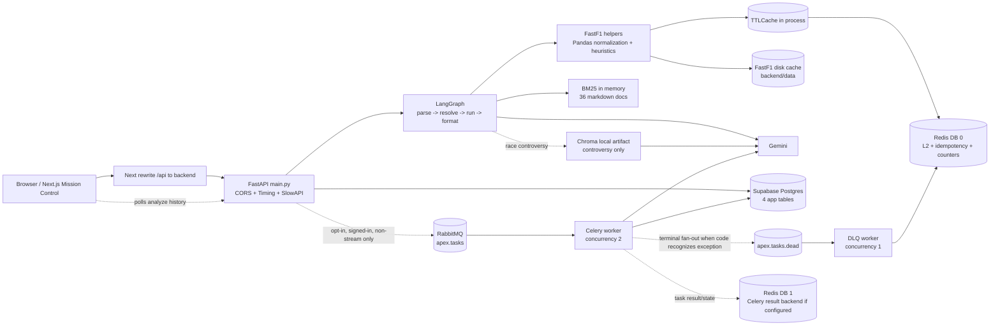
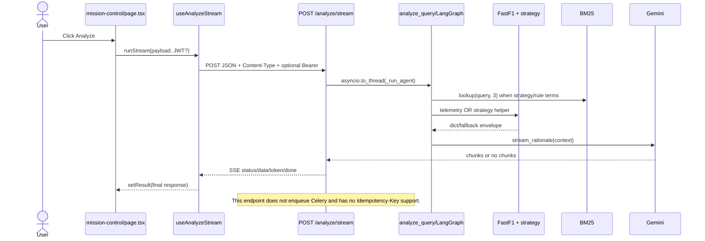
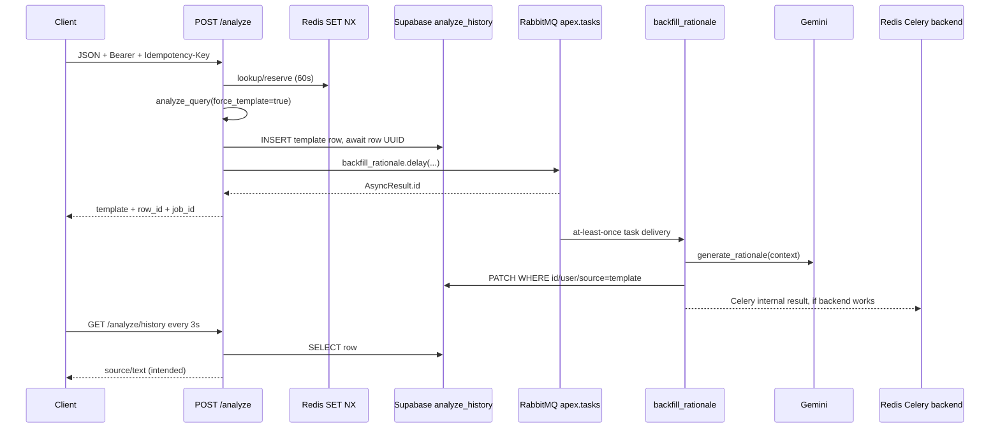

# F1 Race Engineer — Source-Grounded Interview Defense

> Mục tiêu: giúp một Java Backend developer quen JDK 1.8 có thể đọc, lần request, chất vấn failure mode và thiết kế lại dự án bằng Spring Boot.
>
> Ngày audit: **2026-08-20**. Nhánh làm việc: `develop`. Tài liệu tham chiếu CV: `JavaBackendEngineer_VuThanhDat.pdf` (trích text cục bộ, không sửa PDF).
>
> Quy tắc bằng chứng: code đang chạy quan trọng hơn README/spec; Git history chỉ chứng minh artifact từng tồn tại, **không chứng minh ai sở hữu hoặc tự viết nó**.

## Cách đọc evidence

Mọi dẫn chứng dùng dạng `path:Lx-Ly — symbol`. Line number là snapshot tại ngày audit. `Verified` nghĩa là có source/artifact hiện tại; không có nghĩa là đã chạy production. `UNKNOWN - ASK DAT` nghĩa là repository không thể chứng minh đóng góp cá nhân.

## Kế hoạch thực thi đã dùng

1. Kiểm tra `git status`, instruction files, README/spec/architecture và loại generated/dependency directories.
2. Lập inventory first-party, lần FastAPI, frontend, FastF1, strategy, RAG/LLM, Celery/RabbitMQ/Redis, Supabase và eval.
3. Đối chiếu CV/PDF với source và Git artifacts; không suy ownership.
4. Chạy kiểm tra offline có kiểm soát, ghi lại kết quả, audit diagram/metric/coverage và kiểm tra `git status` cuối.

---

## 1. Verified executive summary

### Kết luận ngắn, không tô hồng

- Đây là monorepo có **Next.js 16.2.6/React 19 frontend** và **FastAPI/Python backend**, không phải Java service (`frontend/package.json:L12-L20`; `backend/requirements.txt:L1-L31`). CV ghi “React/Next.js + FastAPI” là phù hợp về stack.
- Dữ liệu chính là **historical/session data được FastF1 tải khi có request**, rồi cache ra `backend/data`; không có live timing ingestion service, Kafka stream hay feed receiver riêng (`backend/tools/fastf1_helper.py:L433-L528`; `docs/ARCHITECTURE.md:L217-L221`). Cụm từ CV “ingests race telemetry” chỉ an toàn nếu giải thích là on-demand historical ingestion, không phải real-time pipeline.
- Request strategy chạy logic deterministic: lấy lap/weather features, tính decay bằng công thức, chia ba tier để suy pit window, rồi tính undercut risk/gain (`backend/tools/fastf1_helper.py:L642-L743`; `backend/tools/strategy_helper.py:L24-L120,L123-L290`). Đây không phải ML predictor đã train.
- RAG chính của rationale dùng **BM25Okapi** trên **36 markdown files**, mỗi file là một document. Index nằm trong memory, tokenization chỉ regex lowercase; không có stemming, stop-word removal hay embedding trong flow rationale chính (`backend/tools/knowledge_retriever.py:L26-L29,L60-L100,L111-L141`).
- Tuy nhiên repo hiện còn có **ChromaDB + Gemini embedding** cho controversy analysis (`backend/tools/vector_store.py:L1-L11,L34-L57,L62-L121`; `backend/agents/race_engineer.py:L680-L740`). Vì vậy tài liệu cũ nói “no vector DB” không còn đúng cho toàn hệ thống.
- Gemini chỉ biến computed facts/citations thành câu giải thích. `generate_rationale` chỉ kiểm tra output non-empty, không validate schema/numeric grounding sau generation; khi lỗi trả `None` để template tiếp quản (`backend/core/llm.py:L58-L69,L105-L139`; `backend/agents/race_engineer.py:L457-L489`).
- Celery/RabbitMQ là **opt-in async rationale backfill**, không phải toàn bộ telemetry pipeline. Nó chỉ được enqueue từ non-stream `POST /analyze`, khi `RATIONALE_ASYNC=true` và có authenticated user (`backend/app/main.py:L347-L415`). Mission Control hiện ưu tiên SSE `/analyze/stream`, endpoint này không enqueue Celery (`frontend/src/hooks/useAnalyzeStream.ts:L49-L69`; `backend/app/main.py:L464-L586`).
- RabbitMQ là Celery broker; Redis vừa là L2 cache, idempotency/counters, vừa có thể là Celery result backend ở DB index khác. Client không đọc Celery result từ Redis; frontend poll Supabase `analyze_history` (`backend/tasks/__init__.py:L65-L107`; `frontend/src/hooks/useRationaleUpgrade.ts:L73-L97`).
- Có Supabase Postgres với bốn app tables: `analyze_history`, `telemetry_history`, `radio_history`, `saved_queries`; không được nói “không có relational DB” (`backend/migrations/0001_analyze_history.sql:L11-L36` đến `backend/migrations/0004_saved_queries.sql:L11-L35`).
- 25 fixtures và `23/25 = 92%` được source-confirmed và đã tái lập offline trong audit. Nhưng metric chỉ đo “actual first pit-in lap nằm trong recommended window mở rộng ±2”, không đo toàn bộ strategy correctness hay LLM accuracy (`backend/tests/test_strategy_pit_eval.py:L45-L57,L77-L101,L157-L217`).
- `40%` baseline có historical README/Git artifact 2/5, nhưng snapshot cũ không còn trong current tree. “Six tracked cycles” là narrative trong README + commit sequence, chưa có machine-readable experiment ledger. Ownership của mọi cải tiến: `UNKNOWN - ASK DAT`.

### Ba cảnh báo phỏng vấn lớn nhất

1. Đừng nói “frontend request nào cũng qua Celery”. Flow chính hiện là SSE synchronous-in-thread; Celery chỉ có non-stream opt-in path.
2. Đừng nói “92% model accuracy”. Hãy nói “23/25 fixture windows covered the recorded first pit-in lap within ±2 laps in the committed offline snapshot”.
3. Đừng nhận “tôi tự xây” từ sự tồn tại của code. File untracked `docs/INTERVIEW_PROJECT_FLOW.md:L15-L17` có một ownership claim rất rộng nhưng không có bằng chứng độc lập; phải tự xác nhận với Dat.

---

## 2. Beginner mental model bằng tiếng Việt

Hãy tưởng tượng hệ thống như một nhà hàng:

- **Next.js UI** là nhân viên nhận order: người dùng chọn mùa giải, chặng, session, driver và bấm Analyze.
- **FastAPI** là quầy kiểm order: Pydantic kiểm kiểu/range; SlowAPI giới hạn tần suất; dependency đọc JWT nếu có.
- **LangGraph agent** là tờ checklist bốn bước, không phải AI tự do: parse intent → bổ sung context → chạy helper → format response.
- **FastF1** là kho dữ liệu bên ngoài. Helper tải session, lấy lap/telemetry/weather thành Pandas DataFrame rồi biến thành dict JSON nhỏ.
- **Strategy helper** giống business rule Java: công thức + `if/elif`, không phải neural network.
- **BM25** giống search keyword có chấm điểm: document nào chứa từ hiếm và phù hợp query hơn sẽ lên trước.
- **Gemini** là người viết lời giải thích từ dữ kiện đã chuẩn bị; mất Gemini vẫn còn deterministic template.
- **RabbitMQ** là băng chuyền job, **Celery worker** là bếp background. Chỉ async rationale backfill dùng băng chuyền này.
- **Redis** là bộ nhớ nhanh dùng nhiều vai: cache, idempotency, counter, và optional Celery result backend. Nó không phải source of truth cho user history.
- **Supabase Postgres** là sổ lưu history thật. Frontend poll sổ này để xem worker đã nâng template thành LLM text chưa.

### Một câu nói an toàn

> The backend separates deterministic race-data computation from natural-language generation. FastF1 and rule-based helpers produce facts; BM25 retrieves supporting notes; Gemini summarizes those facts with a template fallback. Celery is an optional backfill path, not the telemetry ingestion path.

---

## 3. Repository and component map

### Generated/dependency/binary paths đã loại khỏi source review

`.git/`, `.venv/`, `frontend/node_modules/`, `frontend/.next/`, `frontend/.yarn/`, `**/__pycache__/`, `**/.pytest_cache/`, `backend/data/`, `.remember/logs/`, `*.pyc`, `.DS_Store`, `frontend/tsconfig.tsbuildinfo`, binary assets, PDF binary, và `backend/rag/vectorstore/chroma.sqlite3`. Các `.env` thật chỉ được nhận diện tên/ignore status, **không mở hoặc in nội dung**. Chỉ `.env.example` được đọc.

Inventory ban đầu sau exclusion có 363 paths, nhưng gồm editor/agent automation logs và local artifacts. Bảng dưới là inventory theo component; `Partial` nghĩa là đã đọc entrypoint/contract/critical path nhưng không đọc từng UI leaf hoặc mọi corpus body.

| Component | Path | Purpose | Reviewed | Notes |
| --------- | ---- | ------- | -------- | ----- |
| Repo instructions | `.codex/AGENTS.md`, `CLAUDE.md`, `.cursorrules`, `frontend/AGENTS.md` | Workflow/guardrail | Yes | Source thắng doc khi mâu thuẫn |
| Product docs | `README.md`, `docs/PROJECT_SPEC*.md`, `docs/ARCHITECTURE.md` | Intended architecture/claims | Yes | Nhiều count/version đã stale |
| CV | `JavaBackendEngineer_VuThanhDat.pdf` | Claims under audit | Yes, text extract | Không sửa binary |
| Frontend entrypoints | `frontend/src/app/page.tsx`, `mission-control/page.tsx`, `layout.tsx` | Landing/dashboard/layout | Partial | Mission Control critical blocks reviewed |
| Frontend API client | `frontend/src/services/api.ts` | Types, HTTP calls, retry, headers | Yes | Có regular và streaming path |
| Frontend async hooks | `frontend/src/hooks/useAnalyzeStream.ts`, `useRationaleUpgrade.ts`, `useDriverRoster.ts` | SSE, polling, roster | Yes/Partial | SSE hook reviewed fully |
| Frontend state | `frontend/src/lib/store.ts` | Zustand UI state | Yes | Persist chỉ theme |
| Frontend rendering | `frontend/src/components/**` | Charts/HUD/history/citations | Partial | StrategyHUD critical async block reviewed |
| FastAPI entrypoint | `backend/app/main.py` | App, middleware, 23 routes | Yes | Một file lớn, không router modules riêng |
| API schemas | `backend/app/schemas/*.py` | 52 Pydantic classes | Yes | Request/response validation |
| Agent | `backend/agents/race_engineer.py` | Four-node LangGraph + memory + LLM context | Yes | Duration limit chỉ quan sát, không cancel |
| Radio agent | `backend/agents/radio_interpreter.py` | Closed-set LLM classification | Yes | Manual output validation |
| Telemetry ingest | `backend/tools/fastf1_helper.py` | FastF1 load/normalize/cache | Yes | Historical/on-demand |
| Strategy | `backend/tools/strategy_helper.py`, `tyre_helper.py`, `pit_loss.py`, `strategy_compare.py` | Heuristics/what-if | Yes | Static assumptions, deterministic |
| Lap/weather/map tools | `backend/tools/lap_delta*.py`, `weather_helper.py`, `controversy_detector.py` | Derived telemetry views/events | Partial | Main algorithms reviewed |
| BM25 | `backend/tools/knowledge_retriever.py` | Markdown load/index/rank | Yes | 36 docs at audit |
| Semantic RAG | `backend/tools/vector_store.py` | Chroma + Gemini embeddings | Yes | Only controversy path |
| Corpus | `backend/rag/corpus/*.md` | 36 curated notes | Metadata all; bodies partial | First-party prose, sources not independently checked |
| LLM | `backend/core/llm.py` | Gemini config/prompt/cache/parsing | Yes | Deprecated `google.generativeai` warning observed |
| Auth | `backend/core/auth.py` | Supabase JWKS/HS256 deps | Yes | Required vs optional dependency |
| Persistence | `backend/core/persistence.py` | Direct PostgREST CRUD | Yes | Service-role bypasses RLS |
| Migrations | `backend/migrations/0001..0005.sql` | Four tables + async column | Yes | Manual/apply script, no migration table |
| Redis | `backend/core/redis_cache.py`, `idempotency.py` | L2/cache-aside/dedupe | Yes | Fail-open on request path |
| Celery | `backend/tasks/*.py` | App, retries, backfill, DLQ | Yes | Result queried nowhere in app |
| Rabbit metrics | `backend/core/rabbitmq_metrics.py` | Management API queue stats | Yes | Observability only |
| Timing/trace | `backend/core/timing.py`, `trace.py` | In-memory metrics/tool spans | Yes | Per process |
| Eval fixtures | `backend/evals/cases/*` | 25 pit snapshots + 6 LLM cases | Yes | Current pit snapshot committed |
| Eval runners | `backend/tests/test_strategy_pit_eval.py`, `backend/eval/*` | Accuracy vs regression eval | Yes | Hai eval khác mục tiêu |
| Tests | `backend/tests/*.py` | 320 discovered test functions | Partial | Critical infra/eval tests read/run |
| Startup scripts | `scripts/*.sh`, `Makefile` | Local process and compose commands | Yes | `run-backend.sh` tự pip install |
| Containers | `backend/Dockerfile`, `frontend/Dockerfile`, `docker-compose.staging.yml` | Images + 6 services | Yes | Worker concurrency 2, DLQ 1 |
| CI/CD | `.github/workflows/ci-cd.yml`, `.gitlab-ci.yml` | Test/build/push/deploy | Yes | GitLab file fully commented |
| Env templates | `backend/.env.example`, `frontend/.env.local.example`, `backend/infra/.env.example` | Configuration names | Yes | Không đọc `.env` thật |

### First-party files không đọc line-by-line

Đây là danh sách theo glob, không giấu khoảng trống coverage:

- `.claude/**`, `.cursor/**`, `.gemini/**` ngoài các instruction chính; chúng là automation/editor assets, không nằm runtime request path.
- `.codex/git-hooks/**`, `.codex/scripts/**`, các repo skills khác ngoài `f1-data-research`.
- `.remember/**`, `scratchpad.md`, `docs/SESSION_STATUS.md`, `docs/issues/**`, `docs/MVP_PLAN_5_WEEKS.md`, `backend/docs/LESSONS_LEARNED.md`.
- Các body đầy đủ của 36 file `backend/rag/corpus/*.md`; metadata/frontmatter của tất cả đã inventory, một số strategy/regulation bodies được test/review.
- UI leaf components không có network/business logic: `frontend/src/components/Footer.tsx`, `ThemeProvider.tsx`, `icons/**`, phần lớn `landing/**`, `ui/**`, và các mission-control visual-only components (`GapGauge`, `PitWindowTimeline`, chart/canvas/primitives/footer/header/nav/help`).
- Static/content/assets: `frontend/public/**`, `frontend/src/content/*.json`, CSS, manifest, lock files.
- Một số test modules chỉ được collect/chạy nhưng không đọc line-by-line; coverage test execution không đồng nghĩa source review.

Không tuyên bố “đã đọc 100% repository”. Critical backend flow, contract, infra và eval được đọc trực tiếp.

---

## 4. Actual architecture reconstruction

### Source-grounded component diagram



Evidence: frontend rewrite `frontend/next.config.ts:L3-L20`; FastAPI/middleware `backend/app/main.py:L98-L163`; graph `backend/agents/race_engineer.py:L494-L504`; cache `backend/tools/fastf1_helper.py:L180-L224`; BM25 `backend/tools/knowledge_retriever.py:L90-L141`; Celery `backend/tasks/__init__.py:L65-L107`; compose workers `docker-compose.staging.yml:L138-L222`.

### Sequence: current Mission Control default (SSE, no Celery)



Evidence: `frontend/src/app/mission-control/page.tsx:L305-L348`; `frontend/src/hooks/useAnalyzeStream.ts:L49-L136`; `backend/app/main.py:L464-L586`; `backend/agents/race_engineer.py:L579-L620`.

### Sequence: optional async rationale path



Important: intended final arrow currently has a contract defect: Pydantic history schema omits `rationale_text` (`backend/app/schemas/history.py:L7-L20`) although persistence selects it (`backend/core/persistence.py:L195-L211`) and frontend expects it (`frontend/src/services/api.ts:L423-L455`). Audit probe showed Pydantic drops the field.

---

## 5. Startup and configuration flow

### Local

`make dev` → `scripts/dev.sh` checks ports 8000/3000, starts `run-backend.sh` and `run-frontend.sh` (`Makefile:L4-L11`; `scripts/dev.sh:L4-L62`). Backend script creates `.venv`, **runs pip install**, copies `.env.example` if missing, sets `PYTHONPATH=backend`, then starts uvicorn reload (`scripts/run-backend.sh:L7-L21`). Trong audit không chạy script này vì yêu cầu cấm install.

FastAPI lifespan attempts to load gzip prebakes into in-process caches using `asyncio.to_thread`; corrupt/missing entries are logged/skipped (`backend/app/main.py:L98-L110`). `fastf1.Cache.enable_cache` always uses relative `backend/data`; environment key `FASTF1_CACHE_DIR` exists in example but is not read by helper (`backend/tools/fastf1_helper.py:L18-L24`; `backend/.env.example:L25-L27`).

### Container stack

Compose defines `redis`, `rabbitmq`, `worker`, `dlq-worker`, `backend`, `frontend` (`docker-compose.staging.yml:L27-L288`). Backend image runs one uvicorn process (`backend/Dockerfile:L58-L72`). Worker consumes `apex.tasks` with concurrency 2; DLQ worker consumes `apex.tasks.dead` with concurrency 1 (`docker-compose.staging.yml:L158-L168,L206-L216`).

### Configuration keys, không phải secret values

| Area | Keys | Behavior |
| --- | --- | --- |
| LLM | `GEMINI_API_KEY` | Missing → template; code also has deprecated SDK |
| Auth/DB | `SUPABASE_URL`, `SUPABASE_SERVICE_ROLE_KEY`, `SUPABASE_JWT_SECRET`, `SUPABASE_DB_URL` | JWKS/legacy verify, PostgREST, manual migrations |
| Cache | `REDIS_URL`, `REDIS_PASSWORD`, rename keys | Blank → L1 only; compose password required |
| Queue | `CELERY_BROKER_URL`, `CELERY_RESULT_BACKEND`, `CELERY_TASK_ALWAYS_EAGER`, `RATIONALE_ASYNC` | Async path opt-in |
| Rabbit metrics | `RABBITMQ_MANAGEMENT_URL`, `RABBITMQ_USER`, `RABBITMQ_PASSWORD`, `RABBITMQ_VHOST` | Missing creds → zeros + unreachable |
| API | `CORS_ALLOWED_ORIGINS`, `METRICS_ENABLED` | Local origin defaults; timing opt-out |
| Frontend | `NEXT_PUBLIC_API_BASE_URL`, `BACKEND_INTERNAL_URL`, Supabase public vars, site URL | Public vars are build-time for browser |

Naming bug/risk: compose passes `RABBITMQ_MGMT_URL` (`docker-compose.staging.yml:L157,L205,L243`) but code reads `RABBITMQ_MANAGEMENT_URL` (`backend/core/rabbitmq_metrics.py:L45-L49`). Unless both are otherwise configured, override may be ignored.

---

## 6. API inventory

Tất cả 23 route decorators nằm trong `backend/app/main.py`; không có APIRouter modules.

| Method/path | Request/params | Response | Auth/rate | Actual work |
| --- | --- | --- | --- | --- |
| `GET /` | none | welcome dict | none | sync trivial (`L166-L173`) |
| `GET /metrics` | none | route/cache/worker metrics | none | Redis + Rabbit management (`L178-L250`) |
| `GET /events/{year}` | path int | `ScheduleResponse` | none | FastF1 thread (`L253-L269`) |
| `GET /events/{year}/{event}/drivers` | paths | `RosterResponse` | none | Race then Q roster (`L272-L294`) |
| `POST /analyze` | `AnalyzeRequest`; optional headers | `AnalyzeResponse` | optional JWT; 3/10s | idempotency, graph, optional Celery (`L297-L461`) |
| `POST /analyze/stream` | `AnalyzeRequest` | SSE | optional JWT; 3/10s | graph in thread, no Celery/idem (`L464-L586`) |
| `GET /analyze/history` | limit 1..50 | history list | required JWT | PostgREST (`L589-L618`) |
| `POST /radio/analyze` | `RadioRequest` | `RadioResponse` | optional JWT; 3/10s | structured Gemini + optional history (`L621-L658`) |
| `GET /radio/history` | limit, driver | list | required JWT | PostgREST (`L661-L691`) |
| `GET /laps/{...}` | year/event/session/driver | lap list | 30/10s | FastF1 thread (`L694-L724`) |
| `POST /telemetry` | `TelemetryQueryRequest` | strict envelope | optional JWT; 30/10s | FastF1 + optional history (`L727-L773`) |
| `POST /tyre/analyze` | `TyreAnalyzeRequest` | tyre snapshot | 30/10s | prediction + lap roster (`L776-L803`) |
| `POST /weather` | weather request | summary | 30/10s | FastF1 weather (`L806-L834`) |
| `POST /track-map` | track request | points/corners | 20/10s | FastF1 position (`L837-L866`) |
| `POST /strategy/compare` | 1..3 scenarios | outcomes | 5/10s | sequential scenarios + BM25 (`L869-L899`) |
| `POST /lap-delta` | two drivers/laps | 250-point delta | 30/10s | NumPy interpolation (`L902-L930`) |
| `POST /lap-delta-cross-year` | one driver/two years | delta | 10/10s | two FastF1 sessions (`L933-L962`) |
| `GET /telemetry/history` | limit | list | required JWT | PostgREST (`L965-L994`) |
| `POST /saved-queries` | kind/payload/label | created row | required JWT | PostgREST (`L997-L1043`) |
| `GET /saved-queries` | limit | list | required JWT | PostgREST (`L1046-L1071`) |
| `DELETE /saved-queries/{id}` | id | 204/404 | required JWT | owner-filtered delete (`L1074-L1115`) |
| `POST /knowledge/lookup` | query, k 1..10 | citations | 10/10s | BM25 thread (`L1118-L1139`) |
| `GET /knowledge/note/{id}` | id | full note/404 | 30/10s | in-memory lookup (`L1142-L1168`) |

Validation 422 do FastAPI/Pydantic tự trả khi body sai, ví dụ `year >= 2018`, driver length 3, session closed set (`backend/app/schemas/telemetry.py:L6-L15`; `backend/app/schemas/analyze.py:L21-L46`). Route path parameters like `/laps` only typed `str` for session/driver, so validation ở đó yếu hơn POST schema.

---

## 7. Data and persistence model

```mermaid
erDiagram
  AUTH_USERS ||--o{ ANALYZE_HISTORY : user_id
  AUTH_USERS ||--o{ TELEMETRY_HISTORY : user_id
  AUTH_USERS ||--o{ RADIO_HISTORY : user_id
  AUTH_USERS ||--o{ SAVED_QUERIES : user_id
  ANALYZE_HISTORY {
    uuid id PK
    uuid user_id FK
    text query
    text agent_response
    text rationale_source
    text rationale_text nullable
    timestamptz created_at
  }
  TELEMETRY_HISTORY {
    uuid id PK
    uuid user_id FK
    int year
    text event
    text session_type
    text driver
    int lap_number nullable
  }
  RADIO_HISTORY {
    uuid id PK
    uuid user_id FK
    text transcript
    text classification
    text severity
    boolean fallback
  }
  SAVED_QUERIES {
    uuid id PK
    uuid user_id FK
    text kind CHECK_analyze_or_telemetry
    jsonb payload
    text label nullable
  }
```

### Store inventory

| Store | Key/shape | TTL/durability | Invalidation/uniqueness |
| --- | --- | --- | --- |
| Supabase Postgres | 4 tables above | durable external DB | UUID PK; no logical request unique key; cascade on user delete |
| FastF1 disk cache | files under `backend/data` controlled by library | survives process; compose volume bind | library-managed; source has no explicit invalidator |
| Prebake | `data/prebake/<helper>/<16-char-sha>.json.gz` | disk snapshot | loaded with fresh full L1 TTL; no version field (`backend/tools/fastf1_helper.py:L101-L177`) |
| L1 FastF1 cache | tuple args/kwargs → dict | 24h schedule/roster/laps; 1h telemetry/tyre/map | maxsize 32..256; fallbacks not cached (`L60-L98,L180-L224`) |
| Redis L2 | `f1:cache:<namespace>:<digest>` JSON | same helper TTL | cache-aside, no explicit delete (`backend/core/redis_cache.py:L57-L59,L105-L138`) |
| LLM L1/L2 | SHA-256 context → text; namespaces rationale/structured | L1 60s; Redis 1h | no prompt/model version in key except structured prompt payload (`backend/core/llm.py:L43-L52,L72-L74`) |
| Idempotency | `idem:analyze:<client-key>` → pending/done+payload | 60s | atomic NX reservation; no user/body binding (`backend/core/idempotency.py:L34-L112`) |
| Worker counters | `workers:completed_24h`, `workers:failed_24h` | expire 24h from first increment | not a true rolling window; fixed bucket (`backend/tasks/dlq_consumer.py:L40-L74`) |
| Celery result backend | framework-owned Redis keys, URL usually DB 1 | no `result_expires` set in source | app never reads them; exact key/default expiry not source-defined |
| Agent memory | module-level deque of last 10 entries | process lifetime | global, not keyed by user/session (`backend/agents/race_engineer.py:L147-L152,L507-L525`) |
| Timing metrics | per-route deque max 500 | process lifetime | FIFO eviction (`backend/core/timing.py:L41-L65`) |
| BM25 index | tuple of 36 parsed docs + BM25 object | process/import cache | only test reset; restart/reload needed (`backend/tools/knowledge_retriever.py:L90-L100,L144-L146`) |
| Chroma | local `rag/vectorstore` collection | persistent SQLite/artifacts | rebuild only when count changes, not content hash (`backend/tools/vector_store.py:L85-L121`) |
| Eval | Python fixture list + JSON snapshot/status | Git artifact | fixture IDs unique by convention; status is manual |

Security nuance: backend uses Supabase **service-role** and therefore bypasses RLS; it must derive `user_id` only from verified JWT `sub` (`backend/core/persistence.py:L9-L15`; `backend/core/auth.py:L125-L145`). RLS still protects direct non-service-role access in migrations.

---

## 8. Three complete end-to-end flows

### Flow A — UI action to immediate response (actual Mission Control SSE)

| # | Step | Exact evidence | Input/output/failure |
| --- | --- | --- | --- |
| 1 | Click trigger | `frontend/src/app/mission-control/page.tsx:L345-L348 — handleAnalyze` | Guard `canRun`, passes selectors |
| 2 | Query/body build | same `L305-L328 — runAnalyze` | Builds natural-language query + explicit session/driver/target |
| 3 | API client | `frontend/src/hooks/useAnalyzeStream.ts:L49-L69 — runStream` | `POST /analyze/stream`; JSON; `Content-Type`; optional Bearer; **no Idempotency-Key** |
| 4 | Validation | `backend/app/schemas/analyze.py:L21-L46 — AnalyzeRequest` | Pydantic validates query/driver/session/target; invalid → 422 |
| 5 | Route/rate | `backend/app/main.py:L464-L484 — analyze_race_data_stream` | SlowAPI 3/10s, optional JWT dependency |
| 6 | Thread bridge | same `L485-L509` | sync graph runs through `asyncio.to_thread`; queue carries events |
| 7 | Service/agent | `backend/agents/race_engineer.py:L560-L620 — analyze_query` | BM25 trigger + LangGraph invoke |
| 8 | Sync work | `backend/agents/race_engineer.py:L315-L386 — run_analysis_node` | Strategy helper runs directly; telemetry has fixed-delay retry |
| 9 | Immediate/stream response | `backend/app/main.py:L507-L586` | keepalive/status/partial/token/done SSE; errors become `error` event |
| 10 | UI update | `frontend/src/hooks/useAnalyzeStream.ts:L100-L136`; `frontend/src/app/mission-control/page.tsx:L336-L343` | hook accumulates partial state, final `setResult` updates Zustand/UI |

“Immediate” ở đây nghĩa HTTP connection nhận incremental events; computation vẫn nằm trên request lifetime. Nếu stream lỗi, hook gọi regular `analyzeTelemetry` (`frontend/src/hooks/useAnalyzeStream.ts:L137-L150`).

### Flow B — asynchronous strategy/rationale job (exists, but not default SSE)

1. Regular client creates one UUID and reuses it for its one network retry: `frontend/src/services/api.ts:L356-L420 — analyzeTelemetry`.
2. `AnalyzeRequest` validation occurs before handler. Optional JWT dependency returns `sub` or `None`: `backend/core/auth.py:L152-L174`.
3. Handler checks `Idempotency-Key`: DONE returns cache, PENDING returns 409, else Redis `SET ... NX EX 60`: `backend/app/main.py:L317-L345`; `backend/core/idempotency.py:L74-L92`.
4. Async flag requires env true **and** `user_id != None`: `backend/app/main.py:L347-L356`.
5. `analyze_query(... force_template=True)` completes strategy synchronously. Thus only prose generation is deferred, not FastF1/strategy: `backend/app/main.py:L358-L366`; `backend/agents/race_engineer.py:L463-L466`.
6. API synchronously inserts `analyze_history` with `rationale_source=template` to obtain row UUID: `backend/app/main.py:L370-L389`; `backend/core/persistence.py:L70-L127`.
7. `backfill_rationale.delay(...)` serializes `row_id`, `user_id`, `llm_context`; Celery creates task ID in producer client and returns `AsyncResult.id`: `backend/app/main.py:L390-L410`.
8. No explicit queue is passed, so Celery default routes to direct exchange/queue/routing key `apex.tasks`: `backend/tasks/__init__.py:L73-L107`. JSON is the only accepted serializer (`backend/tasks/__init__.py:L77-L86`).
9. RabbitMQ transports the Celery message. Source declares max queue length 10,000/reject-publish; delivery mode/durability are library defaults, not explicit source guarantees.
10. Main worker consumes `apex.tasks`, concurrency 2: `docker-compose.staging.yml:L138-L176`.
11. Task `tasks.rationale.backfill_rationale` calls Gemini then conditional PostgREST patch: `backend/tasks/rationale.py:L43-L103`. TransientError auto-retries `max_retries=3`, exponential base 2, cap 60, jitter. This is up to initial attempt + 3 retries.
12. Global Celery uses late ack, reject on worker lost, prefetch 1: `backend/tasks/__init__.py:L77-L87`. No task time limit is configured.
13. Success/failure task state/result may be written by Celery to `CELERY_RESULT_BACKEND`; repo defines no key schema and client never calls `AsyncResult.get/status`.
14. Domain completion is the Supabase row changing template → llm through `PATCH WHERE rationale_source=eq.template`: `backend/core/persistence.py:L133-L179`.
15. Frontend intends to poll `/analyze/history` every 3s for 60s: `frontend/src/hooks/useRationaleUpgrade.ts:L7-L8,L73-L104`.
16. Current blocker: response model omits `rationale_text`; an audit probe confirmed the field is stripped. Job can complete, source can flip to `llm`, but UI may receive no upgraded text.
17. Broker enqueue exception is swallowed; caller receives template row with no job ID: `backend/app/main.py:L411-L415`.

### Flow C — telemetry/tyre features → BM25 → LLM → strategy

1. **Source:** `fastf1.get_session(year,event,session)`; no bespoke ingest daemon (`backend/tools/fastf1_helper.py:L433-L451,L642-L657`).
2. **Parsing:** FastF1 returns session/laps/telemetry/weather Pandas objects.
3. **Transform:** telemetry normalizer requires Speed/nGear/RPM, computes min/max/avg/downsample ≤200; optional throttle/brake (`backend/tools/fastf1_helper.py:L250-L344`). Strategy instead derives lap-time decay, stint count/progress, temperature averages/trend (`backend/tools/fastf1_helper.py:L677-L721`).
4. **Storage/representation:** dicts live in L1/L2 cache; raw library cache on disk. Strategy flow does not persist raw telemetry to Postgres.
5. **Corpus construction:** each sorted markdown file with frontmatter/body becomes one `CorpusEntry`; index document concatenates title + topics + section + body (`backend/tools/knowledge_retriever.py:L60-L100`).
6. **Tokenization:** regex `[a-z0-9]+` after lowercase (`L28-L29,L86-L87`). Vietnamese accents/hyphen nuance are lost; no stemming/synonyms.
7. **Query:** original user query is sent to BM25 only when regulation or strategy regex matches (`backend/agents/race_engineer.py:L128-L139,L583-L600`).
8. **Ranking/top-k:** `BM25Okapi.get_scores`, descending sort, positive scores only, k=3 main flow (`backend/tools/knowledge_retriever.py:L111-L141`).
9. **Strategy:** `predict_tyre_wear` calculates `lap_decay + 0.05*stint_progress + 0.02*temp_trend`, clips ≥0, chooses window fraction tier and scales by lap count (`backend/tools/strategy_helper.py:L52-L120`). `strategy_analyzer` resolves gap, risks, pit-loss assumptions and undercut projection (`backend/tools/strategy_helper.py:L164-L290`).
10. **Context:** `_build_llm_context` sends intent, telemetry_data, strategy_data, citations, stripping BM25 score (`backend/agents/race_engineer.py:L439-L454`).
11. **Prompt:** closed system prompt + pretty JSON session context (`backend/core/llm.py:L58-L69,L125-L128`).
12. **LLM response:** plain string `.text.strip()`; exception/empty → `None` (`backend/core/llm.py:L125-L139`).
13. **Parsing/validation:** rationale has no structural validator. Radio and controversy use `generate_structured` JSON parsing, but controversy fields are only later constrained when AnalyzeResponse Pydantic serializes; radio has explicit enum validation (`backend/core/llm.py:L142-L213`; `backend/agents/radio_interpreter.py:L58-L80`).
14. **Output:** agent returns flattened `StrategySummary` + citations + trace; FastAPI `AnalyzeResponse` validates response (`backend/agents/race_engineer.py:L668-L769`; `backend/app/schemas/analyze.py:L141-L177`).
15. **Fallback:** FastF1 helper returns populated fallback dict; LLM failure returns deterministic template; BM25 failure yields empty citations. No exception should be confused with correct strategy.

Crucial correction: telemetry speed/gear/RPM is not fed into strategy helper. Strategy consumes lap-time/stint/weather features and gap data. Saying “all telemetry channels drive pit prediction” would be false.

---

## 9. Python syntax guide based on actual source

### Python ↔ Java 8 quick map

| Python | Meaning | Java 8 analogy |
| --- | --- | --- |
| `from x import y` | import symbol/module | `import package.Type;` |
| `def f(x: int) -> dict` | function + type hints | typed method; Python hints not JVM enforcement |
| `self` | explicit current object | implicit `this` |
| `dict`, `list`, `tuple`, `set` | map, mutable list, immutable-ish tuple, unique set | `Map`, `List`, small value object, `Set` |
| `[x for x in xs if ...]` | list comprehension | stream/filter/map/collect or loop |
| `{**a, "x": 1}` | copy/merge dict | new `HashMap<>(a); put(...)` |
| `@decorator` | wrap/annotate callable | annotation + AOP/proxy; semantics differ |
| `try/except/finally` | exception handling | `try/catch/finally` |
| `with resource as x` | context manager auto cleanup | try-with-resources |
| `async def`, `await` | coroutine/event loop suspension | `CompletableFuture`/reactive; not same as thread |
| `None`, `x | None` | null/optional | `null`, `Optional<T>` |
| Pydantic `BaseModel` | runtime parse/validate/serialize | DTO + Jackson + Bean Validation |
| FastAPI `Depends(fn)` | resolve dependency per request | injected bean/filter/argument resolver |

### Excerpt 1 — Pydantic request validation

Source `backend/app/schemas/analyze.py:L21-L46`:

```python
class AnalyzeSessionInfo(BaseModel):
    event: str = Field(..., min_length=2, max_length=120)
    year: int = Field(..., ge=2018, le=2100)
    session_type: Literal["FP1", "FP2", "FP3", "Q", "R", "S", "SQ"]

class AnalyzeRequest(BaseModel):
    query: str = Field(..., min_length=3)
    driver: str | None = Field(default=None, min_length=3, max_length=3)
    session_info: AnalyzeSessionInfo | None = None
```

Line-by-line:

- `class X(BaseModel)`: khai báo model Pydantic; gần với Java DTO được Jackson deserialize.
- `event: str`: type hint string. `Field(...)` dùng `...` để nói required, không phải spread operator.
- `ge/le`: greater-or-equal/less-or-equal.
- `Literal[...]`: closed enum ở type/validation level.
- `str | None`: field có thể null; `default=None` làm nó optional.
- Input là JSON body. Output là object Python đã validate. Side effect: không có.
- Có thể fail thành HTTP 422 trước khi route chạy.
- Spring: POJO + `@NotBlank @Size`, `@Min/@Max`, enum, controller parameter `@Valid @RequestBody`.

### Excerpt 2 — FastAPI decorator, dependency và thread offload

Source `backend/app/main.py:L727-L773` (rút gọn):

```python
@app.post("/telemetry", response_model=TelemetryResponse)
@limiter.limit("30/10seconds")
async def get_telemetry(
    request: Request,
    body: TelemetryQueryRequest,
    user_id: str | None = Depends(get_optional_user_id),
):
    telemetry = await asyncio.to_thread(
        get_session_telemetry_summary,
        year=body.year, event=body.event,
        session_type=body.session_type, driver=body.driver,
        lap_number=body.lap_number,
    )
    summary = TelemetrySummary(**telemetry)
```

- Hai dòng `@...` là decorators: đăng ký route và wrap rate limit.
- `async def` trả coroutine; `await` nhường event loop trong lúc chờ.
- `Depends(...)` bảo FastAPI gọi dependency để lấy user ID. Đây không phải constructor injection.
- `asyncio.to_thread` đẩy hàm FastF1 blocking sang threadpool; bản thân FastF1 không async.
- Keyword args làm call dễ đọc. `**telemetry` unpack dict thành constructor arguments.
- Input: validated DTO + headers trong Request. Output: response model JSON; side effect optional history task.
- Có thể fail 422, 429, helper fallback, hoặc unexpected exception 500.
- Spring MVC tương đương `@PostMapping`, `@Valid`, interceptor/filter rate limit, `CompletableFuture.supplyAsync` trên bounded executor; không nên dùng common pool cho I/O nặng.

### Excerpt 3 — collections, comprehension, copy merge

Source `backend/agents/race_engineer.py:L173-L219,L439-L454`:

```python
unique_drivers: list[str] = []
for match in raw_matches:
    code = DRIVER_MAP.get(match.upper(), match.upper())
    if code not in unique_drivers:
        unique_drivers.append(code)

trimmed_citations = [
    {k: v for k, v in c.items() if k != "score"}
    for c in citations
]
```

- `list[str]` là list string; runtime vẫn có thể nhận sai type nếu không validate.
- `.get(key, default)` giống `Map.getOrDefault`.
- `not in` kiểm membership; list là O(n), set thường O(1).
- Outer comprehension tạo list mới; inner dict comprehension copy mọi key trừ `score`.
- Input citations; output sanitized copy; không side effect lên original.
- Fail nếu item không phải dict như dự kiến.
- Java: nested loops hoặc streams; với code interview Java 8, loop rõ ràng thường tốt hơn.

### Excerpt 4 — decorator và exception/finally

Source `backend/core/trace.py:L59-L80`:

```python
def traced(name: str):
    def _wrap(func):
        @wraps(func)
        def _inner(*args, **kwargs):
            start = time.perf_counter()
            status = "ok"
            try:
                return func(*args, **kwargs)
            except Exception:
                status = "error"
                raise
            finally:
                record(name, elapsed_ms, status)
        return _inner
    return _wrap
```

- Function có thể tạo và trả function khác; Python function là object.
- `*args` gom positional args thành tuple; `**kwargs` gom named args thành dict.
- `@wraps` giữ metadata của function gốc.
- bare `raise` ném lại đúng exception hiện tại.
- `finally` luôn chạy để ghi trace kể cả lỗi.
- Input/output giống function gốc; side effect ghi ContextVar trace.
- Java/Spring: custom annotation + AspectJ `@Around`, `try/finally`, `ProceedingJoinPoint`.

### Excerpt 5 — context manager và async resource

Source `backend/core/persistence.py:L41-L60` và `backend/core/rabbitmq_metrics.py:L146-L150`:

```python
async with _client_lock:
    if _client is None:
        _client = httpx.AsyncClient(...)

async with httpx.AsyncClient() as client:
    main_stats, dead_stats = await asyncio.gather(
        fetch_queue_stats(main_queue, client=client),
        fetch_queue_stats(dead_queue, client=client),
    )
```

- `async with` gọi async enter/exit và bảo đảm cleanup/lock release.
- Double-check trong lock tránh tạo hai clients.
- `asyncio.gather` chạy hai coroutine đồng thời, gần với `CompletableFuture.allOf`.
- Input queue names; output tuple results; side effect HTTP reads.
- Có thể timeout, invalid JSON; helper chuyển thành `None`.
- Java: singleton `WebClient`/HTTP client bean; `CompletableFuture` hoặc Reactor zip; tránh tạo client mỗi request nếu không cần.

### Excerpt 6 — Celery task decorator/retry

Source `backend/tasks/rationale.py:L43-L103`:

```python
@app.task(bind=True, base=TaskWithDLQ,
          autoretry_for=(TransientError,), max_retries=3,
          retry_backoff=2, retry_backoff_max=60, retry_jitter=True)
def backfill_rationale(self, row_id: str, user_id: str, llm_context: dict):
    if not row_id or not user_id:
        raise PermanentError("empty identifiers")
    text = generate_rationale(llm_context)
    if not text:
        raise TransientError("generate_rationale returned no text")
    updated = asyncio.run(update_analyze_history_rationale(...))
    return {"updated": bool(updated), "row_id": row_id}
```

- `bind=True` đưa task object vào `self`; tương tự framework context, không phải domain entity.
- `(TransientError,)` là tuple một phần tử; dấu phẩy quan trọng.
- Decorator bảo Celery tự retry chỉ exception đó.
- `raise PermanentError` là invalid input, không nên retry.
- Input phải JSON-serializable do task serializer. Output dict được result backend serialize.
- Side effects: Gemini call + conditional DB patch.
- Spring AMQP: `@RabbitListener`, retry interceptor/backoff, recoverer gửi parking/DLQ; business idempotency trong DB.

### Excerpt 7 — Redis atomic reservation

Source `backend/core/idempotency.py:L74-L92`:

```python
payload = json.dumps({"status": STATUS_PENDING})
ok = client.set(_redis_key(idempotency_key), payload,
                ex=TTL_SECONDS, nx=True)
return bool(ok)
```

- `json.dumps` serialize dict.
- Redis `SET key value EX 60 NX` là một atomic command: chỉ set khi key chưa tồn tại, kèm TTL.
- Input client key; output true cho winner, false cho duplicate.
- Redis lỗi bị catch ở ngoài và trả true: fail-open, nên duplicate vẫn có thể chạy.
- Java: `StringRedisTemplate.opsForValue().setIfAbsent(key,value,Duration)`; vẫn phải bind key với request/user nếu security-sensitive.

### Excerpt 8 — pytest fixture, monkeypatch và mock

Source `backend/tests/conftest.py:L6-L22`; `backend/tests/test_strategy_pit_eval.py:L187-L197`:

```python
@pytest.fixture(autouse=True)
def _default_template_rationale(monkeypatch):
    force_template_rationale(monkeypatch)
    yield

with patch("tools.strategy_helper.extract_tyre_wear_features",
           return_value=features_envelope):
    strategy = strategy_analyzer(..., current_gap_seconds=1.2)
```

- Fixture `autouse=True` chạy quanh từng test; `yield` chia setup/teardown.
- `monkeypatch` thay symbol tạm thời rồi tự hoàn tác.
- `with patch(...)` là context manager giới hạn mock trong block.
- Eval inject committed features để không gọi FastF1.
- Java: JUnit `@Before/@After`, Mockito `@Mock`, constructor injection; static/module patching khó hơn và thường là dấu hiệu cần interface.

---

## 10. Celery, RabbitMQ and Redis analysis

### Why Celery exists here

Chỉ để dời Gemini rationale latency khỏi regular `/analyze` cho signed-in user và backfill row sau. FastF1/strategy vẫn synchronous trước response. Evidence `backend/app/main.py:L347-L410`; `backend/tasks/rationale.py:L1-L16`.

### Configuration audit

| Concern | Source fact | Strict conclusion |
| --- | --- | --- |
| Broker | `CELERY_BROKER_URL`; Rabbit compose user/vhost `apex` | RabbitMQ transports Celery messages |
| Result backend | `CELERY_RESULT_BACKEND`, suggested Redis DB 1 | Config exists; app does not consume result |
| Queues | `apex.tasks`, `apex.tasks.dead` direct exchanges | Backfill uses default main queue |
| Serialization | task/result JSON; accept JSON only | Context must serialize cleanly |
| Ack | `task_acks_late=True` | Ack after execution, enabling redelivery risk |
| Worker lost | `task_reject_on_worker_lost=True` | Broker can redeliver on worker death |
| Prefetch | 1 | Each process reserves roughly one task at a time |
| Retry | only `TransientError`, max 3, backoff base 2/cap 60/jitter | Bounded config exists; broker-backed loop not integration-tested |
| Timeout | none configured for Celery task | Gemini/HTTP can hang until lower-layer timeout; LLM call has no explicit timeout |
| Concurrency | main 2; DLQ 1 | Two worker processes/slots can execute independent tasks |
| Queue bound | max 10,000; reject publish | Producer must handle publish rejection; route catches enqueue exception |
| Result expiry | no `result_expires` in repo | Do not quote an expiry value as project design |
| DLQ | synthetic task from `on_failure` | Not native broker dead-lettering |

### What Redis actually stores

- Application JSON cache values, idempotency pending/done envelopes, two metrics counters.
- Potential Celery task meta/results via framework backend (opaque to app).
- **Không** store user history as source of truth; đó là Supabase.
- **Không** transport Celery tasks; broker là RabbitMQ.

### What status/result retrieval actually does

API trả `rationale_job_id`, nhưng frontend không gọi status endpoint theo job ID. Nó poll `GET /analyze/history` theo row ID. Therefore “Redis task result storage enables client polling” là sai với current client. Redis backend có thể phục vụ Celery internals/operator, không phải current product retrieval contract.

---

## 11. Retry, duplicate delivery and idempotency analysis

### Direct answers

**Worker crashes after DB side effect but before ack?** Late ack + reject-on-lost can cause redelivery. Redelivered task may call Gemini again, then DB patch returns false because row is already `llm`. Final DB state is protected; external LLM cost is not strictly protected (`backend/tasks/__init__.py:L77-L80`; `backend/core/persistence.py:L141-L179`).

**Same task delivered twice?** Both executions can generate text. Conditional update `rationale_source=template` lets at most the first matching PATCH change the row. Two separate task IDs for the same logical row are also possible; there is no unique task ledger.

**Redis unavailable?** FastF1/LLM cache falls to L1; idempotency fails open; counters under-count. If Redis is also configured as Celery result backend, task result recording can fail, but domain completion may still be in Supabase. Compose `depends_on` may prevent worker startup until Redis healthy. Recovery in `redis_cache` requires process restart because failed init is pinned (`backend/core/redis_cache.py:L19-L28,L91-L102`).

**RabbitMQ unavailable?** `.delay()` raises eventually and route logs/swallows, leaving template row and no job ID (`backend/app/main.py:L405-L415`). No producer connection timeout is explicit, so “immediate fallback” is not guaranteed. Main SSE flow is unaffected because it does not enqueue.

**Can two workers process the same logical request?** Yes: at-least-once redelivery, two task IDs, or Redis idempotency fail-open. Worker concurrency is 2. Conditional DB update narrows damage for this one side effect.

**Is retrying every exception safe?** No. Code correctly auto-retries only `TransientError`; invalid identifiers raise `PermanentError`. However task doc says unexpected bare exceptions go DLQ, while `TaskWithDLQ.on_failure` only recognizes `MaxRetriesExceededError` and `PermanentError` (`backend/tasks/__init__.py:L124-L147`). Bare `Exception` is not explicitly routed by this code.

**Does every exhausted transient reach DLQ?** Not proven. Unit test manually calls `on_failure(MaxRetriesExceededError)` (`backend/tests/test_tasks_retry.py:L93-L145`); eager mode does not execute real retry loop. Need broker integration test to verify the final exception type Celery passes to `on_failure` for `autoretry_for` exhaustion.

### Route idempotency limitations

- Only regular `/analyze`, not `/analyze/stream`, `/telemetry`, radio, saved queries.
- TTL only 60s; after that same logical request can re-run/write.
- Key is not validated as UUID, not namespaced by user, not bound to request hash. Reusing same key with a different body within TTL returns old response.
- Fail-open protects availability, sacrifices dedupe correctness.
- DONE response is cached after handler; fire-and-forget history insert can still lag/fail.

### Java/Spring redesign

Use a Postgres `strategy_job(job_id, user_id, request_hash UNIQUE, status, result, version)` as durable state. Controller inserts `PENDING` transactionally, outbox row in same transaction; publisher sends Rabbit message; listener claims with conditional `UPDATE ... WHERE status IN ('PENDING','RETRY')`, calls LLM, then `UPDATE ... WHERE status <> 'COMPLETED'`. Add delivery ID inbox/unique constraint. Redis can accelerate reads, never own correctness. Spring AMQP retry only transient exceptions; parking queue plus replay tooling for terminal failures.

---

## 12. BM25 explanation and source trace

### Beginner explanation

BM25 là keyword ranking tốt hơn “đếm số lần xuất hiện” đơn thuần:

- Từ hiếm trong corpus có trọng số cao hơn từ phổ biến (IDF).
- Một từ xuất hiện thêm nhiều lần vẫn tăng điểm, nhưng lợi ích giảm dần (term saturation).
- Document quá dài bị normalize để không thắng chỉ vì chứa nhiều từ.

Nó không hiểu nghĩa như embedding. Query “box early” có thể không match mạnh note chỉ viết “undercut” nếu corpus không cùng từ.

### Actual implementation

- Documents: 36 markdown notes tại audit, one file = one document.
- Metadata parser: custom YAML-like parser, không PyYAML (`backend/tools/knowledge_retriever.py:L42-L57`).
- Indexed text: title + topics + section + body (`L96-L100`). Source field không nằm indexed text.
- Tokenizer: lowercase `[a-z0-9]+`; punctuation removed (`L28-L29,L86-L87`).
- Library: `rank_bm25.BM25Okapi` (`L22,L90-L100`).
- Score: library `get_scores`; sort descending; drop non-positive (`L120-L140`). Score là ranking signal, không xác suất/confidence.
- Top-k: clamp 1..10; main agent k=3; scenario compare k=2.
- Context: snippets ≤260 chars + metadata; score stripped trước LLM (`backend/tools/knowledge_retriever.py:L103-L108`; `backend/agents/race_engineer.py:L439-L454`).
- Index lifecycle: `@lru_cache(maxsize=1)`, so corpus edit cần process reload/cache reset.

### Why BM25 instead of embeddings?

README/architecture states zero-infra/auditable MVP reason. Nhưng source hiện đã thêm embeddings cho controversy; vì vậy safe statement là: “The main citation/rationale path uses BM25 for a small auditable corpus; a separate controversy path experiments with Chroma/Gemini embeddings.”

### Limitations found

1. No Vietnamese/semantic synonym handling; ASCII token regex degrades accented text.
2. No field weights; repeating topic tokens via title/topics/body affects score implicitly.
3. Whole note is one document; long notes may dilute a relevant paragraph.
4. `k=3` is a manual fix for corpus growth, not quality calibration (`backend/agents/race_engineer.py:L591-L599`).
5. Corpus source claims were not independently verified against official FIA documents in this audit.
6. Chroma rebuild checks only document count, so editing a body without changing count can leave stale embeddings (`backend/tools/vector_store.py:L85-L92`).

---

## 13. Evaluation and metric audit

### 25-fixture pit eval

Fixture structure is `{id, year, event, session_type, driver}` in `backend/evals/cases/strategy_pit_fixtures.py:L18-L202`. Snapshot has 25 matching keys, each containing `actual_first_pit_lap` and a `tyre_features_envelope`. Pass rule:

```text
(recommended_start - 2) <= actual_first_pit_lap <= (recommended_end + 2)
```

Source `backend/tests/test_strategy_pit_eval.py:L45,L77-L85`. Snapshot runner patches extracted features, forces gap 1.2, runs actual current strategy code and asserts `passed >= status.passing` (`L169-L217`). CI invokes snapshot mode after the full backend tests (`.github/workflows/ci-cd.yml:L52-L66`).

### Reproduction during this audit

Command (external keys forced empty):

```bash
PYTHONPATH=backend CELERY_TASK_ALWAYS_EAGER=true \
GEMINI_API_KEY='' GOOGLE_API_KEY='' STRATEGY_PIT_EVAL_SNAPSHOT=1 \
.venv/bin/python -m pytest \
  backend/tests/test_strategy_pit_eval.py \
  backend/tests/test_rationale_task.py \
  backend/tests/test_tasks_retry.py \
  backend/tests/test_tasks_scaffold.py \
  backend/tests/test_idempotency.py \
  backend/tests/test_knowledge_retriever.py -q -s
```

Result: **59 passed, 1 skipped**; pit summary **23/25 (92%)**. Fails: `2024-japan-r-ver` actual lap 1 vs 11-29; `2024-saudi-r-ver` actual lap 7 vs 10-28.

### What 92% does and does not mean

It means coverage of one historical event label—first `PitInTime` lap—by often-wide windows plus ±2. It does not test:

- whether pitting in that window would maximize race result;
- safety-car/red-flag causal context;
- compound choice, traffic, weather decision, opponent reaction;
- calibration/confidence correctness;
- LLM answer correctness;
- unseen holdout generalization.

The gate is `>=23`, while landing page reads a separately manual `status.json` value. A broken snapshot could still pass if exactly 23 broad-window cases remain covered.

### 40% and six cycles

- Historical commit `0faa1a8` introduced five fixtures and runner.
- Historical README at commit `ac74439` records 2/5 with per-case output. Current README `L175-L182` narrates six numbered cycles: 40 → 80 → 65 → 85 → 90 → 92.
- Current tree does not contain six immutable result snapshots or raw logs. Only current 25-case snapshot/status is reproducible.

Verdict: 25 and 23/25 are `SOURCE-CONFIRMED`; 40% and six cycles are `PARTIALLY CONFIRMED`, not fabricated but weaker reproducibility.

### Separate evals

- `backend/eval/strategy_golden.jsonl` has 9 regression cases. `run_strategy_eval.py` checks drift from captured expected values; it answers “did behavior change?”, not “is it correct?”. Full run opt-in/cache-dependent.
- `backend/evals/cases/rationale_fixtures.py` has 6 Gemini prompt fixtures; live external test is opt-in and CI skips it (`backend/tests/test_eval_rationale.py:L1-L23,L44-L71`). It checks substrings, not semantic correctness.

---

## 14. Validation and error handling

| Layer | Protection | Gap |
| --- | --- | --- |
| Pydantic request | ranges, lengths, Literals | some GET paths weakly typed; driver code not roster-validated |
| Rate limit | 429 envelope + Retry-After | in-memory limiter per process; `/metrics` unauthenticated |
| Auth | JWKS/HS256 verify audience, extract `sub` | optional invalid JWT becomes anonymous silently |
| FastF1 | fallback envelope; fallback results not cached | exception strings can still leak unless sanitizer recognizes fragment |
| Agent | clarification, template fallback, recursion limit | 15s “duration limit” does not cancel; checked only after invoke |
| LLM rationale | closed prompt, non-empty check | no output fact validator or explicit request timeout |
| Structured LLM | JSON parse + radio enum validator | controversy dict not explicitly validates every required field before merge |
| Persistence writes | history insert often fail-closed/swallowed | fire-and-forget can be lost at process shutdown; no retry/outbox |
| Async update | conditional template→llm | `False` conflates already-done, missing config, DB failure/no row |
| Idempotency | atomic NX + cached response | fail-open, 60s, key/body/user not bound, absent on SSE |
| Queue | JSON-only, bounded queue, late ack | no task timeout; DLQ exhaustion semantics not end-to-end proven |
| Frontend | request timeouts/retry for selected calls | stream parser is hand-rolled; regular analyze treats 409 as generic error instead of honoring Retry-After |

### Confirmed contract defect: async rationale text removed

Audit probe constructed `AnalyzeHistoryResponse` with `rationale_text`; `.model_dump()` omitted it. Exact cause: backend history schema `backend/app/schemas/history.py:L7-L20` lacks the field. Frontend checks `match.rationale_text` (`frontend/src/hooks/useRationaleUpgrade.ts:L80-L85`). This is a high-risk interview point: explain it honestly as a discovered defect, not as a working production guarantee.

---

## 15. Testing, deployment, CI/CD and observability

### Tests

`rg` found 320 `test_...` functions. Mix of unittest and pytest; TestClient for HTTP; mocks/patches for FastF1, Redis, persistence and Gemini. Celery tests use eager mode, explicitly acknowledging they do not exercise broker retry loop (`backend/tests/test_tasks_retry.py:L1-L18`).

Full suite attempt during audit was interrupted after **6 passed** because `test_driver_fix` entered controversy semantic lookup and Google SDK retry. This proves default suite can reach an external path when a real key is loaded from local `.env`; no secrets were printed. Targeted rerun forced keys empty and passed 59 tests. Do not describe the full suite as hermetically offline.

### CI/CD

- PR/push to `develop`: Python 3.11 install + full backend pytest; snapshot gate; Node 20 Yarn immutable install + lint + build (`.github/workflows/ci-cd.yml:L10-L111`).
- Push to develop after tests: build/push backend/frontend images to GHCR, then POST Dokploy webhook (`L113-L202`).
- `.gitlab-ci.yml` is entirely commented; not active.
- No Docker image build ran in this audit. CI comments/README mentioning a separate docker-build check must be judged against actual workflow, which builds images only on develop push, not PR.

### Observability

- Timing middleware stores last 500 samples per route and returns p50/p95/max/error rate (`backend/core/timing.py:L41-L103`).
- Tool trace uses ContextVar and decorates telemetry/strategy/knowledge helpers (`backend/core/trace.py:L33-L80`; `backend/agents/race_engineer.py:L42-L44`).
- `/metrics` combines Redis counters and Rabbit Management API queue depths (`backend/app/main.py:L197-L250`).
- Logs use stdlib logging; DLQ writes one JSON-shaped ERROR line (`backend/tasks/dlq_consumer.py:L101-L120`).
- No Prometheus exporter, OpenTelemetry, centralized log shipper, alert rule or trace backend is present in source.

---

## 16. Failure modes and trade-offs

| Failure | Actual behavior | Consequence | Defensible improvement |
| --- | --- | --- | --- |
| FastF1/network unavailable | helper catches several failures and may return empty/error-shaped data | strategy may be based on defaults or report no data | distinguish `DATA_UNAVAILABLE` from a real zero; persist a data version |
| Gemini unavailable in SSE | graph retry/fallback produces deterministic rationale | user still gets a strategy, but prose quality/source changes | expose `rationale_source` and degraded status, as the code already partly does |
| Gemini unavailable in Celery | task retries autoretry exceptions; exhausted-path DLQ behavior is incomplete | history can remain pending/failed; client may poll indefinitely without UI timeout | explicit terminal state, retry classification and reconciliation job |
| RabbitMQ unavailable | `.delay()` fails at the API process; endpoint catches it and leaves the already-created template row without a job ID | rationale is never upgraded unless another mechanism repairs it | expose enqueue failure and use an outbox plus broker recovery |
| Redis unavailable | cache/idempotency fail open; Celery backend may fail if selected | duplicate work and missing metrics/results | separate correctness from cache; do not use fail-open lock for money/side effects |
| Supabase unavailable | history insert/update can fail; analysis itself can still be computed in some paths | result may be returned but not recoverable later | transaction/outbox or explicit `persistence_status` |
| Worker dies mid-task | late ack and reject-on-worker-lost are explicitly enabled | broker can redeliver; conditional DB PATCH protects final row, but LLM cost can repeat | retain conditional write and verify crash behavior with a real broker |
| Duplicate HTTP requests | only regular `/analyze` has 60-second query-key lock; SSE has none | same logical request can run twice | server-generated request ID + durable unique constraint |
| Two users ask same query | idempotency key is query-derived and not visibly user-scoped | possible cross-user suppression on regular endpoint | include authenticated subject and normalized request body in key |
| Process restart | in-process agent memory and timing samples vanish | conversational context/metrics reset | externalize state only if product requires it; otherwise state the limitation |
| Slow LLM call | elapsed time checked after invocation, not cancelled | configured duration is not a hard timeout | provider timeout/cancellation and an end-to-end deadline |
| History rationale completion | response model drops `rationale_text` | frontend cannot apply the completed upgrade | add field and contract test from DB row through HTTP JSON |

Trade-off summary: the system intentionally has graceful fallbacks and a thin MVP shape, but several fallbacks blur correctness and availability. A fallback is defensible only when the response tells the caller that it is degraded. Queueing improves isolation and retry capability; it also creates delivery, status, ownership and reconciliation problems that synchronous code does not have.

---

## 17. Java 8 / Spring Boot mapping and redesign

| F1 component | Actual responsibility | Java/Spring equivalent | Important difference |
| --- | --- | --- | --- |
| `app/main.py` route decorator | binds method/path and validates model | `@RestController`, `@PostMapping` | Spring commonly separates controller classes; FastAPI can keep handlers in one module |
| Pydantic `AnalyzeRequest` | parse, type-check and constrain JSON | DTO + `@Valid`, Bean Validation | Pydantic constructs a runtime model; Java DTO fields/setters are statically typed but validation is still runtime |
| `Depends(get_current_user)` | resolve authenticated user | Spring Security principal/filter + injected bean | dependency graph and request lifecycle APIs differ |
| `race_engineer.analyze_query` | orchestration/service logic | `@Service` | Python functions/modules can act as services without an interface/class |
| `@celery_app.task` | declare message-consumed work | `@RabbitListener` or Spring Batch worker | Celery bundles producer, retry and result-backend conventions; Spring AMQP exposes broker semantics more directly |
| `.delay(...)` | publish task | `RabbitTemplate.convertAndSend(...)` | Celery generates task protocol/id; Spring message shape is application-designed |
| RabbitMQ | broker/queue transport | Spring AMQP + RabbitMQ | same external broker, different client framework |
| Redis cache/idempotency | TTL cache, `SET NX`, counters; optional Celery results | Spring Data Redis | Redis lock is not durable business idempotency in either language |
| Supabase REST client | durable history persistence | Spring Data JPA/JdbcTemplate to PostgreSQL | direct DB access gives transactions; Supabase client applies remote API/RLS semantics |
| `try/except` + HTTPException | error mapping | exceptions + `@ControllerAdvice` | Java checked/unchecked distinction has no direct Python equivalent |
| `async def` SSE generator | cooperative streaming | `SseEmitter`, WebFlux `Flux`, or MVC async | `async` does not make CPU/blocking libraries non-blocking automatically |
| pytest monkeypatch/mock | isolated tests | JUnit 4/5 + Mockito | concepts are equivalent; syntax/lifecycle differs |
| BM25 retriever | lexical rank over Markdown chunks | Lucene BM25 or a Java scorer | Lucene supplies mature indexing; current Python corpus is rebuilt in memory |
| Gemini wrapper | prompt and structured output | provider SDK behind `LlmClient` interface | isolate provider DTOs so domain logic remains testable |

### Simplified Java architecture for the optional async rationale flow

```mermaid
flowchart LR
    UI[Next.js] -->|POST /analyses| C[Spring AnalysisController]
    C --> S[AnalysisService: validate + compute strategy]
    S --> DB[(PostgreSQL analysis row)]
    S --> O[(outbox row in same transaction)]
    O --> P[Outbox publisher]
    P -->|analysis.rationale.requested| Q[(RabbitMQ)]
    Q --> W[@RabbitListener RationaleWorker]
    W --> L[LLM client]
    W -->|conditional update by requestId| DB
    UI -->|GET /analyses/{id}| C
    DB --> C
```

Proposed contract:

```java
public final class CreateAnalysisRequest {
    @javax.validation.constraints.NotBlank
    private String query;
    // JavaBean constructor/getter/setter omitted here only for brevity.
}

public enum AnalysisStatus { PENDING_RATIONALE, COMPLETED, FAILED }

@org.springframework.web.bind.annotation.RestController
public class AnalysisController {
    private final AnalysisService service;
    public AnalysisController(AnalysisService service) { this.service = service; }

    @org.springframework.web.bind.annotation.PostMapping("/analyses")
    public org.springframework.http.ResponseEntity<AnalysisView> create(
            @javax.validation.Valid @org.springframework.web.bind.annotation.RequestBody
            CreateAnalysisRequest request) {
        AnalysisView view = service.create(request);
        return org.springframework.http.ResponseEntity.accepted().body(view);
    }
}
```

Design rules:

- Create the analysis row and outbox row in one PostgreSQL transaction. This closes the “DB committed but publish failed” gap.
- Put a stable `requestId` in the message and enforce `UNIQUE(request_id, operation)` in a processed-message table or conditional state update. This makes duplicates harmless.
- Configure retry only for transient failures. Invalid prompt/output is terminal or goes to a review/DLQ path.
- Poll the application database, not Celery/worker internals. The API owns the public state machine.
- Use a bounded listener concurrency and provider timeout. Backpressure is a product behavior, not just a thread-pool setting.
- Java is not automatically faster or safer: explicit types help refactoring, while correctness still depends on transactions, constraints, timeouts and tests.

---

## 18. CV claim audit

| CV claim | Source evidence | Status | Safe interview wording |
| --- | --- | --- | --- |
| Next.js + FastAPI full-stack application | `frontend/package.json`; `frontend/src/app/mission-control/page.tsx`; `backend/app/main.py` | `SOURCE-CONFIRMED` | “The repository contains a Next.js client and FastAPI API; I can trace their request contract.” |
| Celery + RabbitMQ async pipeline | `backend/tasks/__init__.py:L65-L107`; `backend/tasks/rationale.py:L43-L103`; compose worker/broker services | `SOURCE-CONFIRMED` | “An optional authenticated `/analyze` path queues only rationale generation; the default SSE path does not.” |
| Redis caching | `backend/core/redis_cache.py:L57-L138`; `backend/tools/fastf1_helper.py:L180-L224` | `SOURCE-CONFIRMED` | “Redis is optional and fail-open for data caching, idempotency and metrics; it can also be Celery result backend.” |
| Real-time/live F1 telemetry | source loads FastF1 historical/session data on demand; no live timing subscriber found | `CV CLAIM NOT VERIFIED` | “It analyzes FastF1 session data; I would not call it a live telemetry ingestion system.” |
| BM25 retrieval | `backend/tools/knowledge_retriever.py:L42-L141`; 36 committed corpus Markdown files | `SOURCE-CONFIRMED` | “The main strategy context uses in-memory BM25 over Markdown chunks with simple lowercase whitespace tokenization.” |
| No vector database | `backend/tools/vector_store.py:L34-L179` uses Chroma for controversy lookup | `CV CLAIM NOT VERIFIED` | “BM25 is primary, but a separate controversy path has Chroma/embedding support.” |
| 25 ground-truth fixtures | `backend/evals/cases/strategy_pit_fixtures.py:L18-L202`; audit counted 25 | `SOURCE-CONFIRMED` | “The current pit-window snapshot has 25 deterministic cases.” |
| 92% / 23 of 25 | `strategy_pit_status.json`; snapshot run printed 23/25 | `SOURCE-CONFIRMED` | “Under this repository’s tolerance-based snapshot definition, the current heuristic passes 23 of 25 cases.” |
| 40% baseline | README and historical commit `ac74439` show 2/5, but no current immutable baseline result artifact | `PARTIALLY CONFIRMED` | “A documented early five-case run was 2/5; it is not comparable to a model accuracy benchmark.” |
| Six tracked improvement cycles | README narrative and related commits exist; no machine-readable per-cycle result ledger | `PARTIALLY CONFIRMED` | “The repository documents six iterations; only the current snapshot is directly reproducible here.” |
| 92% accuracy | metric is pit-window fixture pass rate, not end-to-end strategy/LLM accuracy | `INFERRED - DO NOT STATE AS FACT` | “Say ‘92% fixture pass rate,’ never broad ‘AI accuracy.’” |
| Built/owned these components personally | source existence and Git history do not establish candidate contribution | `UNKNOWN - ASK DAT` | “State only the files and decisions you can personally explain; clarify AI assistance.” |
| Production-scale distributed system | one compose deployment and limited queue semantics tests; no load/SLO evidence | `CV CLAIM NOT VERIFIED` | “This is an MVP demonstrating distributed components, not evidence of production scale.” |

---

## 19. Personal-ownership questions

Code proves behavior, not authorship. Before the interview, Dat must answer these privately and truthfully:

1. Which three files did I personally edit without accepting an opaque AI-generated patch?
2. Which bug did I reproduce, diagnose and fix? What was the failing test?
3. Why did I choose SSE for the current Mission Control path and Celery only for optional rationale?
4. Did I design the 25 expected laps, copy them from race data, or approve AI proposals? What makes them ground truth?
5. Can I derive the pit-window heuristic constants and defend them, or are they empirical guesses?
6. Did I configure RabbitMQ/Redis/Supabase, or only run the supplied compose stack?
7. Which retry behavior have I observed with a real broker rather than eager-mode tests?
8. Which source-grounded limitation did I knowingly accept for MVP scope?
9. Can I implement the core flow again in Java without copying this code?
10. Where did AI assistance materially influence architecture, tests and documentation?

For every ownership answer use: **what I did → evidence I can show → decision/trade-off I understood → what I would change**. Until Dat supplies that evidence, ownership status throughout this document is `UNKNOWN - ASK DAT`.

---

## 20. Interview question bank

Answer cadence for every item: **Direct answer → reasoning/example → project relevance → stop.** Do not continue speaking to fill silence.

### Easy (10)

#### E1. What does this project do?

- **Direct answer (30–60s):** “It is an F1 race-strategy assistant. The UI sends a natural-language question with optional event context. FastAPI validates it, obtains FastF1-derived telemetry and a heuristic strategy, retrieves relevant Markdown knowledge with BM25, and optionally asks Gemini to explain the result. The current Mission Control response is streamed with SSE; authenticated history can be stored in Supabase.”
- **Giải thích:** Đây là mô tả các khối thật, không gọi nó là hệ thống live. Tách “tính toán heuristic” khỏi “LLM giải thích” để tránh nói LLM tự tính chiến thuật.
- **Evidence:** `frontend/src/app/mission-control/page.tsx:L305-L348`; `backend/app/main.py:L464-L586`; `backend/agents/race_engineer.py:L315-L489`.
- **Follow-up:** Which part is deterministic? — Strategy helper; LLM prose is not.
- **Sai thường gặp:** “AI watches live races and predicts the perfect pit stop.”
- **Ownership:** `UNKNOWN - ASK DAT`.

#### E2. What is FastAPI doing here?

- **Direct answer (30–60s):** “FastAPI is the HTTP boundary. Decorators register routes, Pydantic models validate JSON, dependencies resolve optional or required users, middleware records timing and CORS controls browser access. Route functions then call domain helpers or the analysis graph and serialize response models.”
- **Giải thích:** FastAPI không phải database hay worker. Nó tương đương lớp controller/filter/validation trong Spring.
- **Evidence:** `backend/app/main.py:L98-L163,L297-L586`; `backend/app/schemas/analyze.py:L21-L46`.
- **Follow-up:** What does Pydantic reject? — Missing/invalid constrained fields before business logic.
- **Sai thường gặp:** “FastAPI automatically makes every operation asynchronous.”
- **Ownership:** `UNKNOWN - ASK DAT`.

#### E3. Show me exactly where the frontend sends the request.

- **Direct answer (30–60s):** “The current Mission Control submit handler calls the analyze-stream hook in `page.tsx`. The hook performs `fetch` against `/analyze/stream`, sends JSON and reads SSE frames from the response body. There is also a regular API client `analyzeQuery`, but it is not the default submit path shown by this page.”
- **Giải thích:** Phải phân biệt code tồn tại với code đang được UI gọi. Đây là điểm quan trọng nhất khi trace request.
- **Evidence:** `frontend/src/app/mission-control/page.tsx:L305-L348`; `frontend/src/hooks/useAnalyzeStream.ts:L49-L150`; `frontend/src/services/api.ts:L356-L420`.
- **Follow-up:** What state changes? — Loading/stream events eventually update analysis/result/error state.
- **Sai thường gặp:** Chỉ trỏ vào `api.ts` rồi khẳng định UI gọi `/analyze`.
- **Ownership:** `UNKNOWN - ASK DAT`.

#### E4. What is a Pydantic model?

- **Direct answer (30–60s):** “It is a Python class that defines the runtime shape and validation rules of data. `AnalyzeRequest` describes accepted fields and constraints; FastAPI creates it from JSON or returns a validation error. It is closest to a Java request DTO plus Bean Validation, not a database entity.”
- **Giải thích:** Type hint Python không tự cưỡng chế mọi nơi; Pydantic mới thực hiện parse/validate ở runtime. Model response còn có thể loại bỏ field không khai báo.
- **Evidence:** `backend/app/schemas/analyze.py:L21-L46,L141-L177`; `backend/app/schemas/history.py:L7-L20`.
- **Follow-up:** Why did `rationale_text` disappear? — Response-model serialization omitted an undeclared field.
- **Sai thường gặp:** “Pydantic is Python’s ORM.”
- **Ownership:** `UNKNOWN - ASK DAT`.

#### E5. What is telemetry in this repository?

- **Direct answer (30–60s):** “Telemetry here is FastF1 session and lap data loaded on demand or from caches, then normalized into dictionaries and response models such as speed, throttle, brake, gear, tyres and gaps where available. I found no continuous live-timing subscriber, so I describe it as historical/session telemetry rather than live ingestion.”
- **Giải thích:** `fastf1` có thể tải dữ liệu cuộc đua nhưng repository không có consumer feed thời gian thực. Cache không biến nguồn historical thành live stream.
- **Evidence:** `backend/tools/fastf1_helper.py:L250-L344,L433-L548,L552-L743`; `backend/app/main.py:L727-L773`.
- **Follow-up:** Where is it stored? — FastF1 disk cache, Redis optional cache, and Python objects; not a telemetry SQL table.
- **Sai thường gặp:** “RabbitMQ streams car telemetry into Redis.”
- **Ownership:** `UNKNOWN - ASK DAT`.

#### E6. What does BM25 do?

- **Direct answer (30–60s):** “BM25 ranks text chunks by lexical relevance to a query. This code reads Markdown corpus files, splits them into chunks, lowercases and whitespace-tokenizes text, builds `BM25Okapi`, and returns top-scoring chunks. Those chunks become evidence/context for the LLM; BM25 itself does not generate a strategy.”
- **Giải thích:** BM25 tìm từ khóa hiếm xuất hiện phù hợp, có điều chỉnh độ dài document. Nó không hiểu semantic như embedding.
- **Evidence:** `backend/tools/knowledge_retriever.py:L26-L29,L42-L100,L111-L141`.
- **Follow-up:** What is top-k? — Number of highest-ranked chunks retained.
- **Sai thường gặp:** “BM25 is a vector database or an LLM.”
- **Ownership:** `UNKNOWN - ASK DAT`.

#### E7. What does Redis store?

- **Direct answer (30–60s):** “Redis is optional and has several roles: TTL-cached helper results, short-lived idempotency keys created with `SET NX`, metrics counters, and optionally Celery result-backend records according to configuration. The public client does not directly read Celery result keys; it polls application history.”
- **Giải thích:** Không được trả lời đơn giản “Redis stores task status” vì source dùng nhiều namespace và public status chủ yếu nằm ở Supabase row.
- **Evidence:** `backend/core/redis_cache.py:L57-L138`; `backend/core/idempotency.py:L34-L129`; `backend/tasks/__init__.py:L65-L107`; `frontend/src/hooks/useRationaleUpgrade.ts:L73-L104`.
- **Follow-up:** Is Redis a source of truth? — Not for durable analysis history.
- **Sai thường gặp:** “All telemetry and final strategies are permanently stored in Redis.”
- **Ownership:** `UNKNOWN - ASK DAT`.

#### E8. What is RabbitMQ’s role?

- **Direct answer (30–60s):** “RabbitMQ is Celery’s broker for the optional background rationale task. The API producer publishes a task message; a worker consumes it. RabbitMQ does not calculate telemetry and is not on the default SSE path. Its value is process separation, buffering and delivery, with extra operational and duplicate-delivery complexity.”
- **Giải thích:** Broker chuyển message, Redis có thể làm result backend, Supabase giữ application history—ba vai trò không được trộn.
- **Evidence:** `backend/tasks/__init__.py:L65-L107`; `backend/tasks/rationale.py:L43-L103`; `backend/app/main.py:L297-L461`.
- **Follow-up:** Why not an in-process queue? — It would be lost on restart and cannot naturally serve separate workers.
- **Sai thường gặp:** “RabbitMQ is the task worker.”
- **Ownership:** `UNKNOWN - ASK DAT`.

#### E9. How is the application started locally?

- **Direct answer (30–60s):** “Docker Compose defines backend, frontend, RabbitMQ, Redis, Celery worker and DLQ consumer services. The backend can also run with Uvicorn/FastAPI and the frontend with its package scripts when dependencies already exist. Configuration comes from environment keys; this audit inspected examples only, not secret `.env` values.”
- **Giải thích:** Startup phải phân biệt process web, broker, cache và worker. Một command chạy API không tự chạy Celery worker.
- **Evidence:** `docker-compose.staging.yml:L1-L222`; `backend/app/main.py`; `frontend/package.json`; `backend/.env.example`; `frontend/.env.local.example`; `backend/infra/.env.example`.
- **Follow-up:** What happens without Redis/RabbitMQ? — Many sync features remain, while cache/async behavior degrades.
- **Sai thường gặp:** “Starting FastAPI starts all infrastructure.”
- **Ownership:** `UNKNOWN - ASK DAT`.

#### E10. Is there a relational database?

- **Direct answer (30–60s):** “Yes. The repository has Supabase/PostgreSQL migrations for profiles, saved races, analyses and related updates. The backend uses a Supabase client to insert and update analysis history. Telemetry itself is not modeled as relational tables in the inspected source.”
- **Giải thích:** Không được nói “không có DB vì Redis.” Migration là bằng chứng schema; Redis là store tạm/cache.
- **Evidence:** `supabase/migrations/0001_initial_schema.sql` through `0005_analysis_rationale.sql`; `backend/core/persistence.py:L70-L211`.
- **Follow-up:** What enforces uniqueness? — Discuss exact migration constraints, not an assumed ORM entity.
- **Sai thường gặp:** “Redis is the project’s only database.”
- **Ownership:** `UNKNOWN - ASK DAT`.

### Medium (15)

#### M1. Trace the default request end to end.

- **Direct answer (30–60s):** “Mission Control calls `useAnalyzeStream`, which posts JSON to `/analyze/stream`. FastAPI validates `AnalyzeRequest`, resolves an optional user, and invokes the analysis graph. The graph calls telemetry and strategy tools, BM25 retrieval and LLM formatting, while the endpoint emits SSE stages. The hook parses events and updates UI state; authenticated history may be persisted.”
- **Giải thích:** Flow này chạy trong API request process; chữ ‘stream’ là stream tiến độ/kết quả, không phải Celery hay live telemetry.
- **Evidence:** `frontend/src/app/mission-control/page.tsx:L305-L348`; `frontend/src/hooks/useAnalyzeStream.ts:L49-L150`; `backend/app/main.py:L464-L586`; `backend/agents/race_engineer.py:L494-L620`.
- **Follow-up:** Which operation can block? — FastF1 and Gemini calls unless their wrappers/timeouts isolate them.
- **Sai thường gặp:** “Every request is sent through RabbitMQ.”
- **Ownership:** `UNKNOWN - ASK DAT`.

#### M2. Show me exactly where the task is created.

- **Direct answer (30–60s):** “In the regular `/analyze` handler, after synchronous strategy generation and persistence, the code conditionally calls the rationale Celery task with `.delay(...)` when async rationale is enabled and the user is authenticated. Celery creates a task ID and publishes through the configured broker. This is not reached by the default SSE route.”
- **Giải thích:** `.delay()` là producer shortcut; decorator đăng ký function phía worker. Cần chỉ đúng điều kiện branch, không chỉ tên file task.
- **Evidence:** `backend/app/main.py:L297-L461`; `backend/tasks/rationale.py:L43-L103`; `backend/tasks/__init__.py:L65-L107`.
- **Follow-up:** Who generates the ID? — Celery unless an explicit task ID is supplied; source does not create a business request ID there.
- **Sai thường gặp:** “FastAPI creates the task when the app starts.”
- **Ownership:** `UNKNOWN - ASK DAT`.

#### M3. Why is this operation asynchronous?

- **Direct answer (30–60s):** “Only rationale generation is optionally asynchronous because an LLM call is slow and failure-prone, while the deterministic strategy can be returned first. A worker allows retry and keeps that provider latency outside the immediate response. The trade-off is a pending state, polling, duplicates and broker dependency; the default SSE design chooses a different trade-off.”
- **Giải thích:** Lý do phải gắn với code: strategy đã tính xong; task không offload toàn bộ analysis. Nếu LLM là bắt buộc cho correctness thì fallback này cần xem lại.
- **Evidence:** `backend/app/main.py:L297-L461`; `backend/tasks/rationale.py:L43-L103`; `frontend/src/hooks/useRationaleUpgrade.ts:L73-L104`.
- **Follow-up:** Why not return `202` for all work? — Product latency/complexity choice; current implementation wants immediate strategy.
- **Sai thường gặp:** “Celery makes Python code faster.”
- **Ownership:** `UNKNOWN - ASK DAT`.

#### M4. How does authentication enter a request?

- **Direct answer (30–60s):** “FastAPI dependencies parse the bearer token and resolve a current user through the auth helper. Some routes use an optional user so anonymous analysis can work; persistence and async rationale depend on having an authenticated identity. CORS middleware controls browser origins but is not authentication.”
- **Giải thích:** Dependency injection chạy trước/around handler. Phải phân biệt authentication, authorization/RLS và CORS.
- **Evidence:** `backend/core/auth.py:L125-L196`; `backend/app/main.py:L98-L163,L297-L586`.
- **Follow-up:** Is token verification local or remote? — Answer only after tracing the selected helper/config; do not guess.
- **Sai thường gặp:** “CORS prevents unauthorized API calls.”
- **Ownership:** `UNKNOWN - ASK DAT`.

#### M5. How are LLM outputs validated?

- **Direct answer (30–60s):** “The LLM wrapper builds system/user prompts and asks for structured output in one path, then parses it into expected models or falls back to deterministic text. The graph also formats a final flattened response. Validation reduces malformed output risk, but it does not prove factual strategy correctness.”
- **Giải thích:** Schema validation chỉ kiểm tra cấu trúc/type. Factual grounding cần telemetry, retrieved context và tests riêng.
- **Evidence:** `backend/core/llm.py:L58-L69,L105-L213`; `backend/agents/race_engineer.py:L439-L489,L668-L769`.
- **Follow-up:** What if JSON is malformed? — Explain caught exception/fallback from the exact wrapper.
- **Sai thường gặp:** “Pydantic guarantees the LLM answer is correct.”
- **Ownership:** `UNKNOWN - ASK DAT`.

#### M6. How does the strategy heuristic work at a high level?

- **Direct answer (30–60s):** “The helper derives tyre and race context, estimates degradation and selects pit windows using explicit thresholds and widening rules. The result is deterministic for the same normalized inputs. It is a hand-built heuristic evaluated against pit-lap fixtures, not a trained machine-learning predictor.”
- **Giải thích:** Nên vẽ input → feature → threshold/tier → window. Không gọi constants là learned weights nếu source không train chúng.
- **Evidence:** `backend/tools/strategy_helper.py:L24-L120,L123-L290`; `backend/evals/cases/strategy_pit_fixtures.py:L18-L202`.
- **Follow-up:** Which thresholds matter most? — Open source and name them; do not memorize invented values.
- **Sai thường gặp:** “Gemini predicts the pit window.”
- **Ownership:** `UNKNOWN - ASK DAT`.

#### M7. What happens when FastF1 returns incomplete data?

- **Direct answer (30–60s):** “Helpers normalize values and have cache/fallback/error paths; downstream strategy code can use defaults or produce limited output. This preserves availability but creates ambiguity between ‘zero’ and ‘unknown.’ A stronger design would carry data-quality flags and refuse high-confidence recommendations when required fields are missing.”
- **Giải thích:** Fallback không đồng nghĩa correctness. Interviewer sẽ hỏi field nào optional và confidence có phản ánh data availability không.
- **Evidence:** `backend/tools/fastf1_helper.py:L250-L344,L433-L743`; `backend/agents/race_engineer.py:L315-L386`.
- **Follow-up:** How would you test this? — Fixtures with missing laps/tyres and explicit degraded assertions.
- **Sai thường gặp:** “FastF1 always provides complete telemetry.”
- **Ownership:** `UNKNOWN - ASK DAT`.

#### M8. How does status polling work?

- **Direct answer (30–60s):** “After an authenticated regular analysis creates a history row and queues rationale, the frontend upgrade hook periodically requests analysis history and looks for the matching item. The worker updates the durable row when rationale completes. It is application-level polling; the browser does not call Celery’s Redis result backend.”
- **Giải thích:** Public job state nằm trong domain record, tốt hơn lộ Celery internals. Nhưng hiện schema response làm rơi `rationale_text`, nên flow completion bị lỗi contract.
- **Evidence:** `frontend/src/hooks/useRationaleUpgrade.ts:L73-L104`; `backend/core/persistence.py:L70-L211`; `backend/app/schemas/history.py:L7-L20`; `backend/tasks/rationale.py:L43-L103`.
- **Follow-up:** How do you fix polling? — Add response field, terminal states, timeout/backoff and a contract test.
- **Sai thường gặp:** “The UI polls Redis by task ID.”
- **Ownership:** `UNKNOWN - ASK DAT`.

#### M9. Explain cache lifetime and invalidation.

- **Direct answer (30–60s):** “Redis helper results use TTL-based expiration, and idempotency keys expire after a short window. FastF1 also uses local disk cache behavior. I did not find event-driven invalidation; freshness depends on key construction and TTL. That is acceptable for historical sessions but risky if presented as live data.”
- **Giải thích:** TTL là invalidation theo thời gian, không phát hiện source thay đổi. Cần nói rõ key/version và trường hợp stale.
- **Evidence:** `backend/core/redis_cache.py:L57-L138`; `backend/core/idempotency.py:L34-L129`; `backend/tools/fastf1_helper.py:L60-L224`.
- **Follow-up:** What is a cache stampede? — Many misses recompute the same expensive value; current lock coverage is limited.
- **Sai thường gặp:** “Redis automatically knows when FastF1 data changes.”
- **Ownership:** `UNKNOWN - ASK DAT`.

#### M10. How are exceptions exposed to clients?

- **Direct answer (30–60s):** “Pydantic validation becomes FastAPI validation errors; handlers raise or translate HTTP exceptions, and SSE sends error events because headers may already be committed. Background tasks cannot return HTTP errors, so they update state/log or retry. These three boundaries need different error contracts.”
- **Giải thích:** Một `try/except Exception` chung thường làm mất classification. SSE error phải là event; worker error phải là durable terminal state.
- **Evidence:** `backend/app/main.py:L297-L586`; `backend/tasks/rationale.py:L43-L103`; `backend/core/llm.py:L105-L213`.
- **Follow-up:** How would Spring map them? — `@ControllerAdvice`, SSE event, and listener retry/DLQ policy.
- **Sai thường gặp:** “All exceptions automatically become HTTP 500, including worker failures.”
- **Ownership:** `UNKNOWN - ASK DAT`.

#### M11. How is the 92% result calculated?

- **Direct answer (30–60s):** “The snapshot runner executes 25 fixed cases. A case passes when the recorded actual pit lap falls within the predicted window expanded by a two-lap tolerance. The current status artifact and my offline run show 23 passes, so 23 divided by 25 is 92%. It is a heuristic fixture pass rate, not overall product accuracy.”
- **Giải thích:** Cần nói denominator, tolerance và hai failure. Expected lap có thể là curated label nhưng source không chứng minh quy trình độc lập tạo ground truth.
- **Evidence:** `backend/tests/test_strategy_pit_eval.py:L45-L57,L77-L101,L157-L217`; `backend/evals/cases/strategy_pit_status.json`; `backend/evals/cases/strategy_pit_fixtures.py`.
- **Follow-up:** Which cases fail? — Japan VER and Saudi Arabia VER in this audit run.
- **Sai thường gặp:** “The LLM is 92% accurate on 25 races.”
- **Ownership:** `UNKNOWN - ASK DAT`.

#### M12. Why use BM25 instead of embeddings?

- **Direct answer (30–60s):** “For a small committed Markdown corpus, BM25 is cheap, deterministic, offline and easy to inspect. It works well when the query shares domain terms with notes. It performs poorly on paraphrases and its tokenizer is simple. The source also contains a separate Chroma/embedding path for controversy lookup, so this is not an absolute project-wide choice.”
- **Giải thích:** Source không ghi đầy đủ decision record, vì vậy phần “why” là trade-off hợp lý chứ không được gán ownership.
- **Evidence:** `backend/tools/knowledge_retriever.py:L42-L141`; `backend/tools/vector_store.py:L34-L179`; `backend/agents/race_engineer.py:L680-L740`.
- **Follow-up:** How would you compare them? — Fixed queries, relevance labels, Recall@k/MRR, latency and failure behavior.
- **Sai thường gặp:** “BM25 understands meaning better than vectors.”
- **Ownership:** `UNKNOWN - ASK DAT`.

#### M13. What do the Docker and CI configurations actually guarantee?

- **Direct answer (30–60s):** “Compose documents a multi-process local/deployment topology. CI installs Python and Node dependencies, runs backend tests plus the strategy snapshot, then lint/builds the frontend. On develop push it builds images and invokes a Dokploy webhook. This does not prove production health, migration safety, load capacity or broker delivery correctness.”
- **Giải thích:** Pipeline passing means checks passed in that environment only. Eager Celery tests especially do not simulate RabbitMQ acknowledgment/requeue.
- **Evidence:** `docker-compose.staging.yml:L1-L222`; `.github/workflows/ci-cd.yml:L10-L202`; `backend/tests/test_tasks_retry.py:L1-L18`.
- **Follow-up:** What integration test is missing? — Real broker + worker crash/duplicate/retry scenarios.
- **Sai thường gặp:** “Docker Compose means the system is cloud-native and highly available.”
- **Ownership:** `UNKNOWN - ASK DAT`.

#### M14. What is the difference between `async def` and Celery?

- **Direct answer (30–60s):** “`async def` provides cooperative concurrency inside an application process when awaited operations are non-blocking. Celery runs work in separate worker processes via a broker and can outlive the HTTP request. Async syntax alone gives no durability or retry, while Celery adds operational state and delivery semantics.”
- **Giải thích:** Gọi thư viện blocking bên trong `async def` vẫn block event loop. SSE endpoint và Celery task giải quyết hai loại concurrency khác nhau.
- **Evidence:** `backend/app/main.py:L464-L586`; `backend/tasks/rationale.py:L43-L103`; `backend/tasks/__init__.py:L65-L107`.
- **Follow-up:** Could you use a bounded executor? — Yes for local work, but it lacks durable cross-process queue semantics.
- **Sai thường gặp:** “`async` automatically starts a background thread.”
- **Ownership:** `UNKNOWN - ASK DAT`.

#### M15. How would you map this request to Spring Boot?

- **Direct answer (30–60s):** “I would use a validated DTO in `@RestController`, a transactional `AnalysisService`, PostgreSQL for public job state, and an outbox row committed with the analysis. A publisher sends a stable request ID to RabbitMQ; an idempotent `@RabbitListener` calls an isolated LLM client and conditionally completes the row. The client polls `GET /analyses/{id}` or uses SSE.”
- **Giải thích:** Outbox giải quyết dual write DB/message. Unique key/conditional transition xử lý duplicate; retry chỉ transient errors.
- **Evidence:** Actual comparison points: `backend/app/main.py:L297-L461`; `backend/tasks/rationale.py:L43-L103`; `backend/core/persistence.py:L70-L211`.
- **Follow-up:** Why not Redis as source of truth? — TTL/cache loss should not erase durable user history.
- **Sai thường gặp:** “Replace every Python function one-for-one with a Java class.”
- **Ownership:** `UNKNOWN - ASK DAT`.

### Hard / senior-level (15)

#### H1. What happens if the worker crashes after the side effect but before acknowledgement?

- **Direct answer (30–60s):** “The source enables late acknowledgement and reject-on-worker-lost, so a worker crash can cause RabbitMQ to redeliver. If the Supabase update already committed, the repeated conditional PATCH matches no template row and becomes a no-op. However, the second execution can call Gemini again before discovering that, so final database state is protected but external cost is not exactly once.”
- **Giải thích:** `task_acks_late=True` và `task_reject_on_worker_lost=True` là bằng chứng rõ. Side effect có hai phần: provider call và DB patch; chỉ DB patch có điều kiện idempotent.
- **Evidence:** `backend/tasks/__init__.py:L77-L80`; `backend/tasks/rationale.py:L43-L103`; `backend/core/persistence.py:L133-L179`; eager-test caveat `backend/tests/test_tasks_retry.py:L1-L18`.
- **Follow-up:** Where would you store the dedupe record? — Durable DB unique constraint, ideally same transaction as business update.
- **Sai thường gặp:** “Celery guarantees exactly-once execution.”
- **Ownership:** `UNKNOWN - ASK DAT`.

#### H2. What happens if the same task is delivered twice? Is it idempotent?

- **Direct answer (30–60s):** “Two deliveries can both call the LLM. The persistence update filters by row ID, user ID and `rationale_source=template`, so only the first can flip the durable row to `llm`; the second update is a no-op. Therefore the database effect is idempotent, but provider calls and cost are not. The separate HTTP `SET NX` guard does not solve task redelivery.”
- **Giải thích:** “Idempotent” phải nói rõ phạm vi. Conditional PATCH bảo vệ final row; nó không ngăn LLM chạy hai lần.
- **Evidence:** `backend/tasks/rationale.py:L53-L103`; `backend/core/persistence.py:L133-L179`; `backend/core/idempotency.py:L34-L129`.
- **Follow-up:** How to prevent stale overwrite? — Conditional update from `PENDING` plus version/attempt check.
- **Sai thường gặp:** “Redis cache makes every task idempotent.”
- **Ownership:** `UNKNOWN - ASK DAT`.

#### H3. Can two workers process the same logical request?

- **Direct answer (30–60s):** “Yes. Separate messages can represent the same query, a broker can redeliver, and the current lock expires after 60 seconds and is not used by SSE. Celery normally gives one delivery to one consumer at a time, but that is not the same as one logical request exactly once. A durable business key and state transition are required.”
- **Giải thích:** Phân biệt delivery identity, task ID và business request identity. Hai request HTTP giống nhau có thể tạo hai task ID khác nhau.
- **Evidence:** `backend/core/idempotency.py:L34-L129`; `/analyze` versus `/analyze/stream` in `backend/app/main.py:L297-L586`; conditional update `backend/core/persistence.py:L133-L179`.
- **Follow-up:** What should the business key include? — User/tenant, normalized full input, operation/version; or client-supplied idempotency key.
- **Sai thường gặp:** “RabbitMQ never sends the same work to two workers.”
- **Ownership:** `UNKNOWN - ASK DAT`.

#### H4. Is retrying every exception safe?

- **Direct answer (30–60s):** “No. This task correctly declares autoretry only for `TransientError`, with three retries, exponential backoff, a 60-second cap and jitter; invalid IDs raise `PermanentError`. One caveat is that `generate_rationale` collapses provider failures into `None`, which the task classifies as transient, so the lower layer can erase useful distinctions.”
- **Giải thích:** Retry là replay. Source đã có classification tốt hơn retry-all, nhưng boundary LLM trả `None` làm nhiều nguyên nhân khác nhau bị gom thành transient.
- **Evidence:** `backend/tasks/rationale.py:L43-L94`; `backend/tasks/__init__.py:L110-L147`; `backend/core/llm.py:L105-L139`.
- **Follow-up:** Why jitter? — Avoid synchronized retry storms.
- **Sai thường gặp:** “More retries always increase reliability.”
- **Ownership:** `UNKNOWN - ASK DAT`.

#### H5. Does the DLQ reliably contain all permanently failed tasks?

- **Direct answer (30–60s):** “Not proven. The failure hook publishes only for selected exception types such as maximum-retry or permanent errors. A bare terminal exception does not automatically satisfy that branch, and eager unit tests do not prove broker routing after real retry exhaustion. I would call the DLQ scaffold partial until a RabbitMQ integration test verifies headers, routing and consumer behavior.”
- **Giải thích:** Có queue/service trong compose không có nghĩa mọi failure đến đó. Phải trace signal/hook với exception thực tế.
- **Evidence:** `backend/tasks/__init__.py:L110-L147`; `backend/tasks/dlq_consumer.py:L40-L120`; `backend/tests/test_tasks_retry.py:L1-L18`.
- **Follow-up:** What metadata must a DLQ message contain? — Original task/business ID, attempt, error class, timestamps and safe input reference.
- **Sai thường gặp:** “Celery automatically puts every failed task in this custom DLQ.”
- **Ownership:** `UNKNOWN - ASK DAT`.

#### H6. What happens if Redis is unavailable?

- **Direct answer (30–60s):** “Cache and idempotency helpers fail open, so requests still run but recompute and may duplicate. Metrics can disappear. If Redis is configured as Celery’s result backend, backend state operations may fail even though the broker delivered work. The project’s public completion path uses Supabase history, but availability and degraded signals are inconsistent.”
- **Giải thích:** Failure mode phụ thuộc Redis role. Một outage có thể không làm API chết nhưng làm mất protection/observability.
- **Evidence:** `backend/core/redis_cache.py:L57-L138`; `backend/core/idempotency.py:L34-L129`; `backend/tasks/__init__.py:L65-L107`.
- **Follow-up:** Should idempotency fail open? — Only for harmless/cost-tolerant work, never irreversible side effects.
- **Sai thường gặp:** “Redis failure has no effect because it is only a cache.”
- **Ownership:** `UNKNOWN - ASK DAT`.

#### H7. What happens if RabbitMQ is unavailable?

- **Direct answer (30–60s):** “Publishing `.delay()` can fail in the API process. The regular handler catches and logs that failure, then returns the already-computed template response without a rationale job ID. There is no transactional outbox, so persistence and publication are not atomic; a broker outage can leave the row permanently at the template state.”
- **Giải thích:** Đây là dual-write gap: DB insert thành công rồi publish thất bại. Code không thực hiện một Gemini call inline để tự sửa row trong branch này.
- **Evidence:** `backend/app/main.py:L297-L461`; `backend/tasks/__init__.py:L65-L107`.
- **Follow-up:** How does an outbox help? — Commit intent with domain row, publish/retry independently.
- **Sai thường gặp:** “RabbitMQ buffers the task even while unreachable.”
- **Ownership:** `UNKNOWN - ASK DAT`.

#### H8. Is the configured analysis duration limit a real timeout?

- **Direct answer (30–60s):** “No hard cancellation is evident. The graph measures elapsed duration and can report/fallback after calls, but a blocking provider invocation may already have exceeded the limit. A real deadline must be propagated to HTTP/provider calls or enforced with cancellable process/task limits, with cleanup and terminal state.”
- **Giải thích:** Kiểm tra đồng hồ sau call không ngắt call. `asyncio.wait_for` cũng không luôn dừng blocking thread/native work.
- **Evidence:** `backend/agents/race_engineer.py:L535-L620`; `backend/core/llm.py:L105-L213`.
- **Follow-up:** Would Celery soft time limit solve it? — Partly; no such config is visible, and side effects still need idempotency.
- **Sai thường gặp:** “An `if elapsed > limit` statement guarantees the SLA.”
- **Ownership:** `UNKNOWN - ASK DAT`.

#### H9. Audit the frontend/backend completion contract.

- **Direct answer (30–60s):** “The worker writes `rationale_text`, persistence selects it, and the frontend hook reads it. But `AnalyzeHistoryItem`, used as FastAPI’s response model, omits that field, so serialization strips it. I reproduced this with a local Pydantic model dump. The background job may finish while the browser never receives the text.”
- **Giải thích:** Đây là contract bug qua bốn layer. Fix phải có schema field và end-to-end response test, không chỉ unit test DB update.
- **Evidence:** `backend/core/persistence.py:L185-L211`; `backend/app/schemas/history.py:L7-L20`; `frontend/src/hooks/useRationaleUpgrade.ts:L80-L85`; `backend/tasks/rationale.py:L43-L103`.
- **Follow-up:** Could status still change? — Inspect schema fields; even if yes, missing text prevents intended upgrade.
- **Sai thường gặp:** “If SQL selected the field, FastAPI must return it.”
- **Ownership:** `UNKNOWN - ASK DAT`.

#### H10. How trustworthy is the 25-fixture evaluation?

- **Direct answer (30–60s):** “It is reproducible as a narrow regression test: fixed inputs, deterministic heuristic and explicit tolerance. It is weak evidence of generalization because labels, threshold tuning and evaluation cases live in the same repository, tolerance is broad, and there is no held-out set or independent labeling record. It should be reported as 23/25 snapshot pass rate.”
- **Giải thích:** Tuning trên test gây leakage. Fixture coverage không đo telemetry parsing, LLM factuality, latency hay future races.
- **Evidence:** `backend/evals/cases/strategy_pit_fixtures.py`; `backend/tests/test_strategy_pit_eval.py:L45-L57,L157-L217`; `README.md:L175-L182` cycle narrative.
- **Follow-up:** How would you improve it? — Freeze train/dev/test seasons, record provenance, compare baselines and report confidence intervals/error categories.
- **Sai thường gặp:** “92% means production recommendations are correct 92% of the time.”
- **Ownership:** `UNKNOWN - ASK DAT`.

#### H11. How were the 25 fixtures created?

- **Direct answer (30–60s):** “The source contains hand-authored-looking fixture structures with event, driver, telemetry-derived inputs and actual pit lap, but I found no artifact proving who labeled them or an automated extraction/provenance pipeline. Therefore their structure and count are confirmed; their independent ground-truth creation process is not. I must answer ownership separately and honestly.”
- **Giải thích:** Giá trị có tên `actual_pit_lap` không tự chứng minh ground truth. Cần source URL/session/version và rule xử lý multi-stop.
- **Evidence:** `backend/evals/cases/strategy_pit_fixtures.py:L18-L202`; related README narrative.
- **Follow-up:** What metadata would you add? — FastF1 version, session ID, extraction query, label timestamp and reviewer.
- **Sai thường gặp:** “FastF1 automatically generated and verified all 25 labels,” khi không có pipeline bằng chứng.
- **Ownership:** `UNKNOWN - ASK DAT`.

#### H12. What consistency model does this application expose?

- **Direct answer (30–60s):** “The sync/SSE response is immediate process-local computation; optional rationale is eventually consistent with the Supabase history row. Redis caches are TTL-stale and fail-open. There is no transaction spanning Supabase, RabbitMQ and Redis, so partial states are possible. The API should expose explicit state/version rather than pretend one atomic result.”
- **Giải thích:** Một request có thể trả strategy nhưng history insert fail; row có thể pending nhưng publish fail; retry có thể ghi trễ.
- **Evidence:** `backend/app/main.py:L297-L586`; `backend/core/persistence.py:L70-L211`; `backend/core/idempotency.py:L34-L129`.
- **Follow-up:** How would you model states? — `CREATED → RATIONALE_PENDING → COMPLETED/FAILED`, conditional transitions and reconciliation.
- **Sai thường gặp:** “Using Redis and RabbitMQ makes all components consistent.”
- **Ownership:** `UNKNOWN - ASK DAT`.

#### H13. Identify configuration drift in the repository.

- **Direct answer (30–60s):** “Compose sets `RABBITMQ_MGMT_URL`, while the code reads `RABBITMQ_MANAGEMENT_URL`, so queue-depth metrics may silently miss their endpoint. The example documents `FASTF1_CACHE_DIR`, while the helper uses a fixed relative cache path. These are examples where deployment files and runtime consumers need contract tests or centralized typed settings.”
- **Giải thích:** Env var là API giữa deploy và code. Sai tên thường chỉ lộ ở runtime và observability path dễ bị bỏ qua.
- **Evidence:** `docker-compose.staging.yml`; `backend/app/main.py:L197-L250`; `backend/tools/fastf1_helper.py:L60-L98`; env example key names.
- **Follow-up:** How would Spring help? — `@ConfigurationProperties` validation at startup, still requiring correct deployment names.
- **Sai thường gặp:** “If the variable is in Compose, the app uses it.”
- **Ownership:** `UNKNOWN - ASK DAT`.

#### H14. How would you make retrieval quality measurable?

- **Direct answer (30–60s):** “I would separate retrieval from generation and create query–relevant-chunk judgments. Measure Recall@k, MRR or nDCG, inspect zero/low-score behavior, and version corpus plus tokenizer. Then test generated answers only after retrieval is stable. The current strategy snapshot does not evaluate BM25 relevance, and count-only Chroma rebuild detection can miss edited content.”
- **Giải thích:** End-to-end answer pass không chỉ ra lỗi retriever hay LLM. Corpus generic có thể lấn át topical note ở low k.
- **Evidence:** `backend/tools/knowledge_retriever.py:L42-L141`; `backend/tools/vector_store.py:L34-L121`; `backend/tests/test_strategy_pit_eval.py`.
- **Follow-up:** What query set first? — Actual pit/tyre/safety-car questions with independently labeled chunks.
- **Sai thường gặp:** “If the LLM answer sounds good, retrieval is accurate.”
- **Ownership:** `UNKNOWN - ASK DAT`.

#### H15. How would you redesign this in Java and Spring Boot?

- **Direct answer (30–60s):** “I would keep the deterministic strategy core as a pure Java service, isolate FastF1 behind a telemetry gateway, validate DTOs at the controller, and persist an analysis plus outbox atomically in PostgreSQL. Spring AMQP workers would use stable operation IDs, conditional state updates, bounded concurrency and classified retry/DLQ. Redis would remain an optional cache, while the API database owns status.”
- **Giải thích:** Nếu Java không có FastF1 equivalent, gateway có thể vẫn là Python service hoặc preprocessed dataset; không nên rewrite mù. Bắt đầu bằng one flow, contract tests, rồi mới tách service.
- **Evidence:** Mapping derives from `backend/tools/strategy_helper.py:L24-L290`, `backend/app/main.py:L297-L586`, `backend/tasks/rationale.py:L43-L103`, `backend/core/persistence.py:L70-L211`.
- **Follow-up:** What would you not migrate first? — Provider-specific retrieval/telemetry code until contracts and value are stable.
- **Sai thường gặp:** “A Java rewrite automatically eliminates races and makes it exactly-once.”
- **Ownership:** `UNKNOWN - ASK DAT`.

---

## 21. Project-derived Java 8 live-coding exercises

All exercises appear before solutions. Use Java 8 only: no records, `var`, `List.of`, streams added after Java 8, or virtual threads.

### Exercise statements

#### Easy

1. **Average speed:** Given nullable telemetry samples, return the average of finite non-negative speeds as `OptionalDouble`. Reject no valid samples.
2. **Request validation:** Validate an analysis query: trim it, require 3–500 characters, and allow an optional season only from 1950 through the current configured season. Return all validation messages.
3. **Tyre-lap counts:** Given lap records `(compound, lapNumber)`, return compound → number of valid laps. Ignore null/blank compounds and non-positive laps; normalize compound to uppercase.
4. **Task status transition:** Implement `PENDING`, `RUNNING`, `COMPLETED`, `FAILED`; terminal states cannot transition, and allowed transitions are explicit.

#### Medium

5. **TTL telemetry cache:** Implement a generic in-memory cache with injected clock, `get`, `put`, TTL expiration and no unbounded expired entries after cleanup.
6. **Duplicate request guard:** Implement an atomic in-memory `tryAcquire(key, ttl)` suitable for one JVM, including expiration. Explain why it is not distributed idempotency.
7. **Classified retry:** Execute a callable up to `maxAttempts`, retry only `TransientException`, use injected sleeper and exponential delay capped at a maximum. Never retry validation errors.
8. **Pit-window evaluator:** Given predicted start/end, actual pit lap and tolerance, report pass/fail exactly like the repository snapshot rule and summarize passes over a list.

#### Hard

9. **Bounded telemetry fan-out:** Fetch telemetry for many drivers with a fixed-size executor, per-item timeout, stable input ordering, error capture and clean shutdown.
10. **Idempotent rationale consumer:** Given a durable repository abstraction, claim a `requestId` only from `PENDING`, call an LLM, and conditionally complete it. A duplicate must not call the LLM twice.
11. **Thread-safe analysis state machine:** Support legal compare-and-set transitions and an attempt counter under concurrency; return immutable snapshots.
12. **Transactional outbox publisher:** Model claiming unpublished outbox records, publishing, marking success, and releasing failures for retry. Explain the unavoidable publish/mark-success duplicate window.

### Solutions

#### Solution 1 — Average speed

```java
import java.util.*;

public final class TelemetryMath {
    public static OptionalDouble averageSpeed(List<Double> samples) {
        if (samples == null) return OptionalDouble.empty();
        double sum = 0.0;
        int count = 0;
        for (Double value : samples) {
            if (value != null && Double.isFinite(value) && value >= 0.0) {
                sum += value;
                count++;
            }
        }
        return count == 0 ? OptionalDouble.empty()
                          : OptionalDouble.of(sum / count);
    }
}
```

```java
import static org.junit.Assert.*;
import java.util.*;
import org.junit.Test;

public class TelemetryMathTest {
    @Test public void averagesOnlyValidSamples() {
        OptionalDouble v = TelemetryMath.averageSpeed(
            Arrays.asList(100.0, null, -1.0, Double.NaN, 200.0));
        assertTrue(v.isPresent());
        assertEquals(150.0, v.getAsDouble(), 0.0001);
    }
    @Test public void emptyWhenNothingValid() {
        assertFalse(TelemetryMath.averageSpeed(Arrays.asList(null, -1.0)).isPresent());
    }
}
```

- **Edge cases:** null list/value, negative, NaN/infinity, empty input; decide separately whether zero is a valid sensor sample.
- **Complexity:** `O(n)` time, `O(1)` extra space.
- **Project link:** normalized telemetry and aggregation in `backend/tools/fastf1_helper.py:L250-L344,L433-L548`.

#### Solution 2 — Request validation

```java
import java.util.*;

public final class AnalysisValidator {
    public static List<String> validate(String query, Integer season, int currentSeason) {
        List<String> errors = new ArrayList<String>();
        String normalized = query == null ? "" : query.trim();
        if (normalized.length() < 3 || normalized.length() > 500) {
            errors.add("query length must be between 3 and 500");
        }
        if (season != null && (season < 1950 || season > currentSeason)) {
            errors.add("season is out of range");
        }
        return errors;
    }
}
```

```java
import static org.junit.Assert.*;
import org.junit.Test;

public class AnalysisValidatorTest {
    @Test public void returnsAllErrors() {
        assertEquals(2, AnalysisValidator.validate(" ", 1949, 2026).size());
    }
    @Test public void acceptsBoundaryValues() {
        assertTrue(AnalysisValidator.validate("pit", 1950, 2026).isEmpty());
        assertTrue(AnalysisValidator.validate("pit", 2026, 2026).isEmpty());
    }
}
```

- **Edge cases:** whitespace-only, Unicode length policy, null season, invalid configured current year. In production, Bean Validation can handle field rules, while cross-field rules stay in a validator/service.
- **Complexity:** `O(q)` to trim/inspect query, `O(1)` messages here.
- **Project link:** Pydantic boundary in `backend/app/schemas/analyze.py:L21-L46`.

#### Solution 3 — Tyre-lap counts

```java
import java.util.*;

public final class TyreCounter {
    public static final class Lap {
        final String compound; final int number;
        public Lap(String compound, int number) {
            this.compound = compound; this.number = number;
        }
    }
    public static Map<String, Integer> count(List<Lap> laps) {
        Map<String, Integer> result = new LinkedHashMap<String, Integer>();
        if (laps == null) return result;
        for (Lap lap : laps) {
            if (lap == null || lap.compound == null || lap.number <= 0) continue;
            String key = lap.compound.trim().toUpperCase(Locale.ROOT);
            if (key.isEmpty()) continue;
            Integer old = result.get(key);
            result.put(key, old == null ? 1 : old + 1);
        }
        return result;
    }
}
```

```java
import static org.junit.Assert.*;
import java.util.*;
import org.junit.Test;

public class TyreCounterTest {
    @Test public void normalizesAndCounts() {
        Map<String,Integer> out = TyreCounter.count(Arrays.asList(
            new TyreCounter.Lap(" soft ", 1), new TyreCounter.Lap("SOFT", 2),
            new TyreCounter.Lap("", 3), new TyreCounter.Lap("HARD", 0)));
        assertEquals(Integer.valueOf(2), out.get("SOFT"));
        assertEquals(1, out.size());
    }
}
```

- **Edge cases:** null lap/list, locale-sensitive uppercase, unknown compounds, duplicate lap numbers (this exercise counts records, not unique lap IDs).
- **Complexity:** expected `O(n)` time, `O(c)` space for `c` compounds.
- **Project link:** tyre feature extraction in `backend/tools/fastf1_helper.py:L642-L743`.

#### Solution 4 — Task status transition

```java
import java.util.*;

public enum TaskStatus {
    PENDING, RUNNING, COMPLETED, FAILED;

    public boolean canMoveTo(TaskStatus next) {
        if (next == null) return false;
        switch (this) {
            case PENDING: return next == RUNNING || next == FAILED;
            case RUNNING: return next == COMPLETED || next == FAILED;
            default: return false;
        }
    }
    public TaskStatus moveTo(TaskStatus next) {
        if (!canMoveTo(next)) {
            throw new IllegalStateException(this + " -> " + next);
        }
        return next;
    }
}
```

```java
import static org.junit.Assert.*;
import org.junit.Test;

public class TaskStatusTest {
    @Test public void completesOnlyAfterRunning() {
        assertEquals(TaskStatus.COMPLETED,
            TaskStatus.PENDING.moveTo(TaskStatus.RUNNING).moveTo(TaskStatus.COMPLETED));
    }
    @Test(expected=IllegalStateException.class)
    public void terminalStateCannotRestart() {
        TaskStatus.COMPLETED.moveTo(TaskStatus.RUNNING);
    }
}
```

- **Edge cases:** null/same-state transition, retry from failed (requires a new attempt or explicit state), concurrent transitions not covered yet.
- **Complexity:** `O(1)` time/space.
- **Project link:** pending rationale, worker completion and failure require an explicit public state contract.

#### Solution 5 — TTL telemetry cache

```java
import java.util.*;
import java.util.concurrent.*;
import java.util.function.LongSupplier;

public final class TtlCache<K,V> {
    private static final class Entry<V> {
        final V value; final long expiresAt;
        Entry(V value, long expiresAt) { this.value = value; this.expiresAt = expiresAt; }
    }
    private final ConcurrentHashMap<K,Entry<V>> values =
        new ConcurrentHashMap<K,Entry<V>>();
    private final LongSupplier clock;
    public TtlCache(LongSupplier clock) { this.clock = Objects.requireNonNull(clock); }

    public void put(K key, V value, long ttlMillis) {
        if (key == null || value == null || ttlMillis <= 0) {
            throw new IllegalArgumentException("key/value and positive TTL required");
        }
        long now = clock.getAsLong();
        long expiry = ttlMillis > Long.MAX_VALUE - now ? Long.MAX_VALUE : now + ttlMillis;
        values.put(key, new Entry<V>(value, expiry));
    }
    public Optional<V> get(K key) {
        Entry<V> e = values.get(key);
        if (e == null) return Optional.empty();
        if (e.expiresAt <= clock.getAsLong()) {
            values.remove(key, e);
            return Optional.empty();
        }
        return Optional.of(e.value);
    }
    public int cleanup() {
        long now = clock.getAsLong(); int removed = 0;
        for (Map.Entry<K,Entry<V>> item : values.entrySet()) {
            if (item.getValue().expiresAt <= now &&
                values.remove(item.getKey(), item.getValue())) removed++;
        }
        return removed;
    }
}
```

```java
import static org.junit.Assert.*;
import java.util.concurrent.atomic.AtomicLong;
import org.junit.Test;

public class TtlCacheTest {
    @Test public void expiresDeterministically() {
        AtomicLong now = new AtomicLong(100);
        TtlCache<String,String> c = new TtlCache<String,String>(now::get);
        c.put("lap", "data", 10);
        assertEquals("data", c.get("lap").get());
        now.set(110);
        assertFalse(c.get("lap").isPresent());
    }
    @Test(expected=IllegalArgumentException.class)
    public void rejectsZeroTtl() {
        new TtlCache<String,String>(System::currentTimeMillis).put("x", "y", 0);
    }
}
```

- **Edge cases:** clock jumps, overflow, nulls, simultaneous expiration, memory cleanup scheduling. This is local to one JVM and has no cross-process coherence.
- **Complexity:** expected `O(1)` get/put; cleanup `O(n)`; space `O(n)` live plus not-yet-cleaned expired entries.
- **Project link:** Redis/local caching behavior in `backend/core/redis_cache.py:L57-L138` and `backend/tools/fastf1_helper.py:L180-L224`.

#### Solution 6 — Duplicate request guard

```java
import java.util.concurrent.*;
import java.util.concurrent.atomic.AtomicBoolean;
import java.util.function.LongSupplier;

public final class RequestGuard {
    private final ConcurrentHashMap<String,Long> expiry = new ConcurrentHashMap<String,Long>();
    private final LongSupplier clock;
    public RequestGuard(LongSupplier clock) { this.clock = clock; }

    public boolean tryAcquire(String key, long ttlMillis) {
        if (key == null || key.trim().isEmpty() || ttlMillis <= 0)
            throw new IllegalArgumentException();
        final long now = clock.getAsLong();
        final long until = now + ttlMillis;
        final AtomicBoolean won = new AtomicBoolean(false);
        expiry.compute(key, (k, old) -> {
            if (old == null || old <= now) { won.set(true); return until; }
            return old;
        });
        return won.get();
    }
}
```

```java
import static org.junit.Assert.*;
import java.util.concurrent.atomic.AtomicLong;
import org.junit.Test;

public class RequestGuardTest {
    @Test public void onlyFirstWinsUntilExpiry() {
        AtomicLong now = new AtomicLong(1);
        RequestGuard g = new RequestGuard(now::get);
        assertTrue(g.tryAcquire("user:request", 10));
        assertFalse(g.tryAcquire("user:request", 10));
        now.set(11);
        assertTrue(g.tryAcquire("user:request", 10));
    }
}
```

- **Edge cases:** overflow, cleanup, key normalization, JVM restart and multiple instances. A guard only suppresses arrivals; it does not store the original response or make downstream side effects idempotent.
- **Complexity:** expected `O(1)` time and `O(k)` space.
- **Project link:** Redis `SET NX` guard in `backend/core/idempotency.py:L34-L129`. The source guard also needs user/full-body scoping.

#### Solution 7 — Classified retry

```java
import java.util.concurrent.Callable;

class TransientException extends Exception {
    TransientException(String message) { super(message); }
}
interface Sleeper { void sleep(long millis) throws InterruptedException; }

public final class Retryer {
    public static <T> T run(Callable<T> action, int maxAttempts,
                            long initialDelay, long maxDelay, Sleeper sleeper)
            throws Exception {
        if (maxAttempts < 1 || initialDelay < 0 || maxDelay < initialDelay)
            throw new IllegalArgumentException();
        long delay = initialDelay;
        for (int attempt = 1; ; attempt++) {
            try {
                return action.call();
            } catch (TransientException e) {
                if (attempt == maxAttempts) throw e;
                sleeper.sleep(delay);
                delay = delay > maxDelay / 2 ? maxDelay : Math.min(maxDelay, delay * 2);
            }
        }
    }
}
```

```java
import static org.junit.Assert.*;
import java.util.concurrent.atomic.*;
import org.junit.Test;

public class RetryerTest {
    @Test public void retriesTransientThenSucceeds() throws Exception {
        AtomicInteger calls = new AtomicInteger();
        AtomicLong slept = new AtomicLong();
        String out = Retryer.run(() -> {
            if (calls.incrementAndGet() < 3) throw new TransientException("temporary");
            return "ok";
        }, 3, 10, 100, slept::addAndGet);
        assertEquals("ok", out); assertEquals(3, calls.get()); assertEquals(30, slept.get());
    }
    @Test(expected=IllegalArgumentException.class)
    public void doesNotRetryPermanentError() throws Exception {
        Retryer.run(() -> { throw new IllegalArgumentException("bad input"); },
                    3, 1, 4, millis -> {});
    }
}
```

- **Edge cases:** interruption must propagate, zero delay, overflow/cap, side effects before exception, jitter omitted for deterministic exercise.
- **Complexity:** `O(a)` calls and `O(1)` space for `a ≤ maxAttempts`; wall time includes backoff.
- **Project link:** Celery retry classification in `backend/tasks/rationale.py:L43-L103` and failure hook `backend/tasks/__init__.py:L110-L147`.

#### Solution 8 — Pit-window evaluator

```java
import java.util.*;

public final class PitEval {
    public static final class Case {
        final int start, end, actual;
        public Case(int start, int end, int actual) {
            if (start < 1 || end < start || actual < 1) throw new IllegalArgumentException();
            this.start = start; this.end = end; this.actual = actual;
        }
    }
    public static boolean passes(Case c, int tolerance) {
        if (c == null || tolerance < 0) throw new IllegalArgumentException();
        return c.actual >= c.start - tolerance && c.actual <= c.end + tolerance;
    }
    public static int countPasses(List<Case> cases, int tolerance) {
        if (cases == null) throw new IllegalArgumentException();
        int count = 0;
        for (Case c : cases) if (passes(c, tolerance)) count++;
        return count;
    }
}
```

```java
import static org.junit.Assert.*;
import java.util.*;
import org.junit.Test;

public class PitEvalTest {
    @Test public void includesToleranceBoundaries() {
        assertTrue(PitEval.passes(new PitEval.Case(10, 20, 8), 2));
        assertTrue(PitEval.passes(new PitEval.Case(10, 20, 22), 2));
        assertFalse(PitEval.passes(new PitEval.Case(10, 20, 23), 2));
    }
    @Test public void summarizes() {
        assertEquals(1, PitEval.countPasses(Arrays.asList(
            new PitEval.Case(10,20,12), new PitEval.Case(10,20,30)), 2));
    }
}
```

- **Edge cases:** malformed window, negative tolerance, integer underflow for extreme input, multi-stop races and which actual lap is labeled.
- **Complexity:** one case `O(1)`; summary `O(n)` time and `O(1)` space.
- **Project link:** exact tolerance concept in `backend/tests/test_strategy_pit_eval.py:L45-L57,L77-L101`.

#### Solution 9 — Bounded telemetry fan-out

```java
import java.util.*;
import java.util.concurrent.*;

public final class BoundedFetcher {
    public static final class Result<T> {
        public final T value; public final Throwable error;
        private Result(T value, Throwable error) { this.value = value; this.error = error; }
        static <T> Result<T> ok(T v) { return new Result<T>(v, null); }
        static <T> Result<T> error(Throwable e) { return new Result<T>(null, e); }
    }
    public static <T> List<Result<T>> fetch(List<Callable<T>> jobs,
                                             int threads, long timeoutMillis) {
        if (jobs == null || threads < 1 || timeoutMillis <= 0)
            throw new IllegalArgumentException();
        ExecutorService pool = Executors.newFixedThreadPool(threads);
        List<Future<T>> futures = new ArrayList<Future<T>>();
        List<Result<T>> results = new ArrayList<Result<T>>();
        try {
            for (Callable<T> job : jobs) futures.add(pool.submit(job));
            for (int i = 0; i < futures.size(); i++) {
                Future<T> future = futures.get(i);
                try {
                    results.add(Result.ok(future.get(timeoutMillis, TimeUnit.MILLISECONDS)));
                } catch (TimeoutException e) {
                    future.cancel(true); results.add(Result.error(e));
                } catch (ExecutionException e) {
                    results.add(Result.error(e.getCause()));
                } catch (InterruptedException e) {
                    Thread.currentThread().interrupt();
                    results.add(Result.error(e));
                    for (Future<T> pending : futures) pending.cancel(true);
                    while (results.size() < futures.size()) results.add(Result.error(e));
                    return results;
                }
            }
            return results;
        } finally {
            pool.shutdownNow();
        }
    }
}
```

```java
import static org.junit.Assert.*;
import java.util.*;
import java.util.concurrent.*;
import org.junit.Test;

public class BoundedFetcherTest {
    @Test public void preservesOrderAndCapturesFailure() {
        List<Callable<String>> jobs = Arrays.asList(
            () -> "VER", () -> { throw new IllegalStateException("no data"); }, () -> "NOR");
        List<BoundedFetcher.Result<String>> out = BoundedFetcher.fetch(jobs, 2, 1000);
        assertEquals("VER", out.get(0).value);
        assertTrue(out.get(1).error instanceof IllegalStateException);
        assertEquals("NOR", out.get(2).value);
    }
}
```

- **Edge cases:** interruption, tasks ignoring interrupt, empty list, queue growth. This simple per-`get` timeout is maximum wait from observation, not one shared request deadline; production should calculate an absolute deadline and bound submission queue too.
- **Complexity:** `O(n)` submission/result space; ideal wall time roughly `O(total work / threads)` but limited by slow tasks/timeouts.
- **Project link:** parallelizing per-driver FastF1 work must not create unbounded calls or hide partial failures (`backend/tools/fastf1_helper.py:L433-L957`).

#### Solution 10 — Idempotent rationale consumer

```java
public interface AnalysisRepository {
    boolean claimPending(String requestId);       // atomic: PENDING -> RUNNING
    boolean completeRunning(String requestId, String rationale); // atomic
    void failRunning(String requestId, String reason);
}
interface LlmClient { String explain(String prompt) throws Exception; }

public final class RationaleConsumer {
    private final AnalysisRepository repository;
    private final LlmClient llm;
    public RationaleConsumer(AnalysisRepository repository, LlmClient llm) {
        this.repository = repository; this.llm = llm;
    }
    public boolean handle(String requestId, String prompt) throws Exception {
        if (!repository.claimPending(requestId)) return false;
        try {
            String text = llm.explain(prompt);
            if (text == null || text.trim().isEmpty())
                throw new IllegalStateException("empty rationale");
            if (!repository.completeRunning(requestId, text))
                throw new IllegalStateException("state changed while processing");
            return true;
        } catch (Exception e) {
            repository.failRunning(requestId, e.getClass().getSimpleName());
            throw e;
        }
    }
}
```

```java
import static org.junit.Assert.*;
import java.util.concurrent.atomic.*;
import org.junit.Test;

public class RationaleConsumerTest {
    @Test public void duplicateDoesNotCallLlmTwice() throws Exception {
        AtomicReference<String> state = new AtomicReference<String>("PENDING");
        AnalysisRepository repo = new AnalysisRepository() {
            public boolean claimPending(String id) { return state.compareAndSet("PENDING", "RUNNING"); }
            public boolean completeRunning(String id, String text) {
                return state.compareAndSet("RUNNING", "COMPLETED");
            }
            public void failRunning(String id, String why) { state.compareAndSet("RUNNING", "FAILED"); }
        };
        AtomicInteger calls = new AtomicInteger();
        RationaleConsumer c = new RationaleConsumer(repo, p -> { calls.incrementAndGet(); return "box now"; });
        assertTrue(c.handle("r1", "prompt"));
        assertFalse(c.handle("r1", "prompt"));
        assertEquals(1, calls.get());
    }
}
```

- **Edge cases:** crash leaves `RUNNING` stuck; add lease/heartbeat and attempt ID. LLM succeeds then DB completion fails: retry needs provider-cost acceptance and conditional completion. Enforce unique `requestId` in a durable database.
- **Complexity:** `O(1)` local work plus external LLM/database latency and rationale storage.
- **Project link:** moves deduplication before the LLM call; current protection is the post-call conditional PATCH in `backend/tasks/rationale.py:L43-L103` and `backend/core/persistence.py:L133-L179`.

#### Solution 11 — Thread-safe analysis state machine

```java
import java.util.concurrent.atomic.AtomicReference;

public final class AnalysisMachine {
    public enum Status { PENDING, RUNNING, COMPLETED, FAILED }
    public static final class Snapshot {
        public final Status status; public final int attempts;
        Snapshot(Status status, int attempts) { this.status = status; this.attempts = attempts; }
    }
    private final AtomicReference<Snapshot> state =
        new AtomicReference<Snapshot>(new Snapshot(Status.PENDING, 0));

    public Snapshot snapshot() {
        Snapshot s = state.get(); return new Snapshot(s.status, s.attempts);
    }
    public boolean startAttempt() {
        for (;;) {
            Snapshot old = state.get();
            if (old.status != Status.PENDING) return false;
            Snapshot next = new Snapshot(Status.RUNNING, old.attempts + 1);
            if (state.compareAndSet(old, next)) return true;
        }
    }
    public boolean finish(Status terminal) {
        if (terminal != Status.COMPLETED && terminal != Status.FAILED)
            throw new IllegalArgumentException();
        for (;;) {
            Snapshot old = state.get();
            if (old.status != Status.RUNNING) return false;
            if (state.compareAndSet(old, new Snapshot(terminal, old.attempts))) return true;
        }
    }
    public boolean scheduleRetry() {
        for (;;) {
            Snapshot old = state.get();
            if (old.status != Status.FAILED) return false;
            if (state.compareAndSet(old, new Snapshot(Status.PENDING, old.attempts))) return true;
        }
    }
}
```

```java
import static org.junit.Assert.*;
import java.util.*;
import java.util.concurrent.*;
import org.junit.Test;

public class AnalysisMachineTest {
    @Test public void onlyOneConcurrentStarterWins() throws Exception {
        AnalysisMachine m = new AnalysisMachine();
        ExecutorService pool = Executors.newFixedThreadPool(8);
        List<Future<Boolean>> fs = new ArrayList<Future<Boolean>>();
        for (int i=0; i<20; i++) fs.add(pool.submit(m::startAttempt));
        int winners = 0; for (Future<Boolean> f : fs) if (f.get()) winners++;
        pool.shutdownNow();
        assertEquals(1, winners); assertEquals(1, m.snapshot().attempts);
        assertTrue(m.finish(AnalysisMachine.Status.FAILED));
        assertTrue(m.scheduleRetry()); assertTrue(m.startAttempt());
        assertEquals(2, m.snapshot().attempts);
        assertTrue(m.finish(AnalysisMachine.Status.COMPLETED));
        assertFalse(m.scheduleRetry());
    }
}
```

- **Edge cases:** cap attempts and record a new attempt identity on `FAILED → PENDING`; a JVM-local CAS is not enough across workers. Persist status/version and use SQL `UPDATE ... WHERE status=? AND version=?`.
- **Complexity:** expected `O(1)` per transition, `O(1)` space; CAS may spin under contention.
- **Project link:** makes background job transitions explicit instead of inferring completion from loosely related fields.

#### Solution 12 — Transactional outbox publisher

```java
import java.util.*;

public final class OutboxRecord {
    public final long id; public final String requestId; public final String payload;
    public OutboxRecord(long id, String requestId, String payload) {
        this.id=id; this.requestId=requestId; this.payload=payload;
    }
}
interface OutboxRepository {
    List<OutboxRecord> claimBatch(int limit); // transaction + SKIP LOCKED/lease
    void markPublished(long id);
    void release(long id, String error);
}
interface MessagePublisher { void publish(String key, String payload) throws Exception; }

public final class OutboxPublisher {
    private final OutboxRepository repo; private final MessagePublisher publisher;
    public OutboxPublisher(OutboxRepository repo, MessagePublisher publisher) {
        this.repo=repo; this.publisher=publisher;
    }
    public int publishBatch(int limit) {
        int successes = 0;
        for (OutboxRecord row : repo.claimBatch(limit)) {
            try {
                publisher.publish(row.requestId, row.payload);
                repo.markPublished(row.id);
                successes++;
            } catch (Exception e) {
                repo.release(row.id, e.getClass().getSimpleName());
            }
        }
        return successes;
    }
}
```

```java
import static org.junit.Assert.*;
import java.util.*;
import org.junit.Test;

public class OutboxPublisherTest {
    @Test public void marksSuccessAndReleasesFailure() {
        List<Long> marked = new ArrayList<Long>(); List<Long> released = new ArrayList<Long>();
        OutboxRepository repo = new OutboxRepository() {
            public List<OutboxRecord> claimBatch(int n) { return Arrays.asList(
                new OutboxRecord(1,"ok","a"), new OutboxRecord(2,"bad","b")); }
            public void markPublished(long id) { marked.add(id); }
            public void release(long id, String e) { released.add(id); }
        };
        OutboxPublisher worker = new OutboxPublisher(repo,
            (key,payload) -> { if ("bad".equals(key)) throw new Exception("down"); });
        assertEquals(1, worker.publishBatch(10));
        assertEquals(Arrays.asList(1L), marked);
        assertEquals(Arrays.asList(2L), released);
    }
}
```

- **Edge cases:** publisher succeeds then process crashes before `markPublished`; row is republished, so consumer still must deduplicate. Use lease expiry, attempt limits, jitter and an operator-visible terminal state. Do not hold a DB transaction open across a slow publish unless deliberately designed.
- **Complexity:** `O(b)` time and space for batch size `b`, plus broker/database latency.
- **Project link:** closes the non-atomic Supabase-write/`.delay()` gap in `backend/app/main.py:L297-L461` while acknowledging at-least-once delivery.

---

## 22. Source coverage and unresolved gaps

### Coverage conclusion

The component table in section 3 is the coverage claim. All request-boundary, schema, main agent, FastF1, strategy, BM25, LLM, persistence, Redis, Celery, migration, compose and evaluation files cited as `Yes` were reviewed from current source. `Partial` is deliberately not promoted to complete coverage.

### Exhaustive unread/not-fully-read first-party manifest

“Unread” below means **not read completely line-by-line**. A file may have been inventoried, collected by pytest, or sampled. Generated/dependency/binary/secret files listed afterward are excluded rather than falsely called reviewed.

- **Docs/local notes:** `GEMINI.md`; `backend/docs/LESSONS_LEARNED.md`; `docs/CORE_FEATURES_STRATEGY_VALIDATION.md`; `docs/INFRA_HARDENING.md`; pre-existing untracked `docs/INTERVIEW_PROJECT_FLOW.md`; `docs/MVP_PLAN_5_WEEKS.md`; `docs/REDIS_NOTES.md`; `docs/SESSION_STATUS.md`; `docs/issues/BUG-driver-context-mismatch.md`; `scratchpad.md`.
- **Backend partial helper/scripts:** `backend/scripts/apply_migrations.py`; `backend/scripts/prebake.py`; `backend/tools/controversy_detector.py`; `backend/tools/lap_delta.py`; `backend/tools/lap_delta_cross_year.py`; `backend/tools/pit_loss.py`; `backend/tools/strategy_compare.py`; `backend/tools/tyre_helper.py`; `backend/tools/weather_helper.py`. Their route-facing symbols/contracts were traced where used, but whole files were not all read line-by-line.
- **Backend tests not fully read:** `backend/tests/_helpers.py`, `test_analyze_api.py`, `test_driver_fix.py`, `test_eval_rationale.py`, `test_fastf1_cache.py`, `test_fastf1_helper.py`, `test_history_api.py`, `test_lap_api.py`, `test_lap_delta.py`, `test_lap_delta_cross_year.py`, `test_llm_client.py`, `test_llm_rationale.py`, `test_llm_redis_cache.py`, `test_pit_loss.py`, `test_prebake.py`, `test_rabbitmq_metrics.py`, `test_race_engineer.py`, `test_radio_history_api.py`, `test_radio_interpreter.py`, `test_rate_limit.py`, `test_redis_cache.py`, `test_roster_api.py`, `test_saved_queries_api.py`, `test_strategy_compare.py`, `test_strategy_golden.py`, `test_strategy_helper.py`, `test_telemetry_api.py`, `test_telemetry_history_api.py`, `test_timing.py`, `test_trace.py`, `test_tyre_helper.py`, `test_weather_helper.py`. Critical files fully reviewed separately: `conftest.py`, `test_idempotency.py`, `test_knowledge_retriever.py`, `test_rationale_task.py`, `test_strategy_pit_eval.py`, `test_tasks_retry.py`, `test_tasks_scaffold.py`.
- **Frontend app/auth pages not fully read:** `frontend/src/app/admin/page.tsx`; `auth/callback/route.ts`; `manifest.ts`; `observability/page.tsx`; landing `page.tsx`; non-critical parts of `layout.tsx`.
- **Frontend components not fully read:** `TelemetryQueryPanel.tsx`, `Footer.tsx`, `ThemeProvider.tsx`; `auth/AuthButton.tsx`, `auth/SupabaseProvider.tsx`; `icons/TeamIcons.tsx`; every file in `components/landing/`; `components/ui/BoxBoxEmpty.tsx`, `HintTooltip.tsx`, `JargonTooltip.tsx`, `StartingGridLoader.tsx`; and these Mission Control leaves: `GapGauge.tsx`, `HelpModal.tsx`, `IntentTabBar.tsx`, `LapDeltaChart.tsx`, `MissionFooter.tsx`, `MissionHeader.tsx`, `NavRail.tsx`, `PitWindowTimeline.tsx`, `RadioLog.tsx`, `RecentAnalyses.tsx`, `RecentTelemetry.tsx`, `ReferencesPanel.tsx`, `SavedQueriesPanel.tsx`, `ScenarioComparison.tsx`, `SelectorBar.tsx`, `StarButton.tsx`, `StewardsViewPanel.tsx`, `StrategyCanvas.tsx`, `TelemetryChart.tsx`, `TelemetryChartGrid.tsx`, `TimeAxis.tsx`, `TrackMapCanvas.tsx`, `TrackMapPanel.tsx`, `TyreCard.tsx`, `WeatherMismatchBadge.tsx`, `WeatherPill.tsx`, `WhyThisCallPanel.tsx`, `constants.ts`, `index.ts`, `primitives.tsx`, `strategy-canvas.constants.ts`. `StrategyHUD.tsx` was reviewed only around rationale rendering.
- **Frontend support files not fully read:** `frontend/src/content/featured.json`, `glossary.json`; `frontend/src/lib/eval-status.ts`, `f1-seasons.ts`, `race-weekend.ts`, `relative-time.ts`; `frontend/src/lib/supabase/client.ts`, `server.ts`; `frontend/src/hooks/useDriverRoster.ts` outside its API contract.
- **Corpus bodies not fully read (36):** `car_amr23_to_amr24_aston.md`, `car_fw45_to_fw46_williams.md`, `car_mcl60_to_mcl38_mclaren.md`, `car_rb19_to_rb20_redbull.md`, `car_sf23_to_sf24_ferrari.md`, `car_w14_to_w15_mercedes.md`, `drs_activation.md`, `engine_ferrari_066_spec_changes.md`, `engine_honda_rbpt_bring_in.md`, `pit_lane_speed.md`, `reg_sporting_collision_liability.md`, `reg_sporting_overtaking_defence.md`, `reg_sporting_parc_ferme.md`, `reg_sporting_penalty_system.md`, `reg_sporting_pit_lane_procedure.md`, `reg_sporting_race_start.md`, `reg_sporting_safety_car_procedure.md`, `reg_sporting_track_limits.md`, `reg_sporting_virtual_safety_car.md`, `regulation_2022_ground_effect.md`, `regulation_2024_floor_edits.md`, `regulation_2025_front_wing_flex.md`, `regulation_2026_power_unit.md`, `regulation_drs_zone_changes.md`, `safety_car.md`, `strategy_double_stack.md`, `strategy_drs_train.md`, `strategy_free_pit_stop.md`, `strategy_intermediate_crossover.md`, `strategy_overcut.md`, `strategy_sc_pit_window.md`, `strategy_tyre_cliff.md`, `strategy_undercut.md`, `tyre_compounds.md`, `tyre_pirelli_c_range_evolution.md`, `yellow_flag.md`. Metadata/index behavior was inventoried; corpus factual claims were not independently verified.
- **First-party automation/editor bundles outside runtime scope:** every file under `.claude/**`, `.cursor/**`, `.gemini/**`, `.remember/**`, `.codex/git-hooks/**` and `.codex/scripts/**`, except the specifically reviewed instruction files `.codex/AGENTS.md`, `.cursorrules`, `frontend/AGENTS.md`, `CLAUDE.md` and the fully read `.codex/skills/f1-data-research/SKILL.md`. Other `.codex/skills/*` were not applicable and were not read.

Excluded from the unread-source manifest: `.git`, virtualenvs, `node_modules`, `.next`, Yarn cache, Python/pytest caches, `backend/data`, Chroma SQLite artifact, lock/build metadata, images/icons, PDF binary, and real `.env`/backup files. Those are dependency/generated/binary/secret artifacts. No real `.env` content was opened or printed.

### Unsupported or unresolved claims

For the claims below, the strict audit marker is: **`CV CLAIM NOT VERIFIED FROM CURRENT SOURCE`**. The CV table uses its allowed short status `CV CLAIM NOT VERIFIED`.

1. Live/real-time telemetry ingestion: no subscriber/stream receiver found.
2. Broad “92% AI/strategy accuracy”: only 23/25 tolerance-window pass rate exists.
3. Six reproducible experiment runs: narrative/commits exist, but no six-result ledger.
4. Independently produced ground truth: fixture provenance/reviewer process absent.
5. “No vector DB”: contradicted by current Chroma controversy path.
6. Exactly-once task execution: not provided; only final conditional DB update is idempotent.
7. Guaranteed DLQ for every unexpected/exhausted exception: not broker-integration-proven.
8. Production scale, throughput, latency SLO or availability: no load/SLO artifacts.
9. Personal ownership of any component or metric improvement: `UNKNOWN - ASK DAT`.
10. Client retrieval through Redis/Celery result backend: current client polls Supabase history instead.

### Commands and observed results

| Command/check | Result |
| --- | --- |
| `git status --short --branch` before work | `develop...origin/develop`; pre-existing untracked PDF and `docs/INTERVIEW_PROJECT_FLOW.md` |
| inventory with `rg --files`/`find`, exclusions applied | 363 initial paths including automation/local artifacts; 23 FastAPI route decorators; 52 Pydantic classes; 320 test function definitions; 36 corpus Markdown files |
| local `pdftotext JavaBackendEngineer_VuThanhDat.pdf /tmp/...` | CV text inspected locally; PDF untouched |
| full backend pytest attempt with existing environment | interrupted after 6 passed/2 warnings at 135.92s because Google SDK retry entered an external semantic path; no paid API was intentionally called and no secret was printed |
| targeted offline pytest command in section 13 | 59 passed, 1 skipped in 0.35s; snapshot 23/25 (92%) |
| local Pydantic serialization probe | confirmed `AnalyzeHistoryItem` drops supplied `rationale_text` |
| Git-history read-only inspection | corroborated early 2/5 README artifact and sequence of evaluation commits; did not prove ownership |
| Markdown/source-citation checks | 80 fence markers (balanced), 5 Mermaid blocks, 0 trailing-whitespace errors, 0 heading-spacing errors, 0 missing/out-of-range cited paths |
| final `git status --short --branch -uall` | only three untracked paths: pre-existing PDF, pre-existing `docs/INTERVIEW_PROJECT_FLOW.md`, and this requested document |

### Final evidence audit

- Diagrams were rechecked against current route calls, agent graph, cache, persistence, Celery queue config and frontend hooks. Dotted/optional arrows denote conditional paths.
- `23/25` was recalculated by the repository runner. `40%` and six cycles remain only partially confirmed.
- No ownership was inferred from code, CV text or Git author metadata.
- No application source, database, queue, cache, cloud resource, dependency set or `.env` was changed.
- Final worktree confirmation: the audit created only `docs/interview-prep/F1_RACE_ENGINEER_SOURCE_DEFENSE.md`; the PDF and `docs/INTERVIEW_PROJECT_FLOW.md` were already untracked before work began and were preserved unchanged.

---

## 23. Final study checklist

### Ten highest-risk technical gaps to study first

1. **Trace SSE versus Celery without mixing them.** Rehearse both sequence diagrams from file and symbol names.
2. **Explain at-least-once delivery.** Know late ack, reject-on-worker-lost, duplicate LLM cost and conditional PostgREST update.
3. **Stop calling 92% “accuracy.”** State denominator, ±2 rule, two failed cases and lack of held-out evidence.
4. **Learn Python execution semantics.** Decorators, `asyncio.to_thread`, `asyncio.run`, dictionaries, type hints and exception flow.
5. **Understand public job state.** Supabase row versus Celery result backend, and why the frontend does not poll Redis.
6. **Reproduce the `rationale_text` contract bug verbally.** DB SELECT → Pydantic response model → frontend expectation.
7. **Explain telemetry honestly.** Historical/on-demand FastF1 session load, Pandas normalization, caches, no live feed.
8. **Derive BM25 and its limitations.** Lexical tokens/top-k/in-memory index versus Chroma embedding controversy path.
9. **Defend retry classification and DLQ gaps.** Transient versus permanent, bounded backoff, missing real-broker exhaustion proof.
10. **Own a truthful contribution story.** Identify what Dat personally implemented, debugged and decided; source alone cannot answer it.

### Checklist before NAB StarCamp

- [ ] I can start at the browser click and name every function until the final SSE event.
- [ ] I can start at `.delay()` and name broker queue, worker task, retry settings and conditional DB update.
- [ ] I can explain what happens when RabbitMQ, Redis, Supabase, FastF1 or Gemini is unavailable.
- [ ] I can draw the four-table persistence model without inventing a telemetry table.
- [ ] I can explain every Python excerpt in section 9 and rewrite its responsibility in Java 8.
- [ ] I can answer E1–E10 within 60 seconds each without vague architecture words.
- [ ] I can answer M1–M15 with exact source evidence.
- [ ] I can answer H1–H15 without claiming exactly-once, production scale or broad accuracy.
- [ ] I can code exercises 1–8 unaided and explain tests/complexity.
- [ ] I can design exercises 9–12 with bounded concurrency, database CAS, idempotency and outbox trade-offs.
- [ ] I have written truthful answers to all ten ownership questions in section 19.
- [ ] I will say “I do not know from current source” when evidence ends.

### Final one-minute defense

> This repository is an F1 strategy MVP, not a proven live production platform. Its deterministic Python helpers load FastF1 session data and compute heuristic outputs; BM25 retrieves source notes; Gemini supplies optional language with a template fallback. The main UI uses SSE in the API process. A separate authenticated path can queue rationale backfill through Celery and RabbitMQ, with Redis for optional cache/result roles and Supabase for durable history. The strongest metric is a reproducible 23-of-25 tolerance-window snapshot, not end-to-end AI accuracy. I can explain the failure modes and would redesign the async path in Spring Boot with a durable state machine, transactional outbox, idempotent consumer and classified retry.
